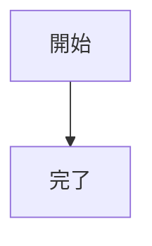

# Markdown Easy Visual Editor

Markdown Easy Visual Editor は、ライブプレビューを見ながら Markdown を記述できる VS Code 拡張機能です。文書は Markdown のまま保持されるため、ソースを直接編集しながら描画結果を確認できます。


## 主な機能

- Markdown を編集し、結果を左右にプレビューできます。
- 左右分割、テキストのみ、プレビューのみを切り替えできます。
- リボンから文字書式、リスト、リンク、画像、表、コードブロック、数式、Mermaid 図、脚注、アラートなどを操作できます。
- 見出しから生成されたアウトラインで長い文書を移動できます。
- Windows/Linux では `Ctrl+F`、macOS では `Cmd+F` で検索・置換できます。
- 画像を貼り付けたりドロップしたりして、ローカルアセットとして保存できます。
- プレビュー上で画像のサイズと配置を変更できます。
- 表を TSV としてコピーし、表計算ソフトのデータを Markdown 表へ貼り付けできます。
- スプレッドシートに近い表編集 UI で、セルの直接編集、行・列の操作、列幅・行高の調整、UI の移動・サイズ変更ができます。
- 出力前にローカルリンクと画像を確認できます。
- 文書を PDF としてプレビュー・出力できます。
- 画像とリンク先 Markdown のオプションを指定して HTML として出力できます。

## 必要条件

- Visual Studio Code 1.100 以降。
- 画像を挿入する場合は、ローカルに保存された Markdown 文書が必要です。
- PDF と HTML の出力には、信頼済みの VS Code ワークスペースが必要です。

## 始め方

1. VS Code で `.md` または `.markdown` ファイルを含むフォルダーを開きます。
2. Markdown ファイルを開きます。
3. 通常のテキストエディターで開いた場合は、ファイルを右クリックして **Open With > Markdown Easy Visual Editor** を選択します。コマンドパレットから **Markdown Easy Visual Editor: Open in visual editor** を実行することもできます。
4. テキストペインで文書を編集し、プレビューペインで結果を確認します。
5. `Ctrl+S`（macOS は `Cmd+S`）で保存します。

## 表示を選ぶ

エディター上部の表示ボタンで、次の 3 種類のレイアウトを切り替えできます。

- **左右分割**: Markdown のソースとプレビューを同時に表示します。
- **テキストのみ**: Markdown のソースに集中します。
- **プレビューのみ**: 編集ペインを表示せず、描画結果を読みます。

**表示** タブの **アウトライン** ボタンで、見出しアウトラインを表示・非表示にできます。アウトラインの見出しを選択すると該当箇所へ移動します。`Ctrl+ホイール` または `Cmd+ホイール` でエディターとプレビューをズームできます。

文書の表示領域を広げたい場合は、リボンを折りたためます。

### アウトラインからセクションを並べ替える

アウトライン項目を右クリックしてドラッグすると、対応する Markdown セクションを並べ替えできます。ドラッグした見出しと、その子孫にあたる見出しは一緒に移動します。ドロップ位置は対象の前後に表示されます。

並べ替え中に見出しレベルを変更することはできません。

- 親見出しは、子見出しを含めて同じ見出しレベルの別の親の位置へ移動できます。
- 子見出しは、同じ見出しレベルを維持すれば別の親へ移動できます。子孫も一緒に移動します。
- 子見出しは、子見出しを持たない親へドロップできます。その親の最初の子として配置されますが、見出しレベルは変わりません。
- `#` 見出しを `##` 見出しへ移動するような、異なる見出しレベル間の移動はできません。

たとえば、`# A` を `# B` の後へ移動すると、`# A` のセクション全体が移動します。

```text
移動前:                 移動後:
# A                     # B
## A-1                  ## B-1
# B                     # A
## B-1                  ## A-1
```

`## A-1` を `## B-1` の後へ移動すると、レベル 2 の見出しを維持したまま親が変わります。

```text
移動前:                 移動後:
# A                     # A
## A-1                  # B
# B                     ## B-1
## B-1                  ## A-1
```

アウトラインの移動に成功した後は、元に戻す・やり直すを使用できます。アウトライン項目を左クリックすると、従来どおり見出しへ移動します。

## Markdown の編集と書式設定

リボンはタブに分かれており、よく使う操作を見つけやすくしています。

### ホーム


見出し、引用、箇条書き、番号付きリスト、タスクリスト、字下げ、太字、斜体、取消線、下線、ハイライト、インラインコード、上付き、下付きなどを適用できます。

### 挿入

リンク、画像、表、区切り線、改行、コードブロック、数式、脚注、目次、改ページ、コールアウト、絵文字を挿入できます。コードブロックを挿入するときは言語を選択でき、シンタックスハイライトに反映されます。

### 表

Markdown 表の中にカーソルを置くと、次の操作ができます。

- 表編集 UI を開いてセルを直接編集します。
- 行・列を追加・削除します。
- 行・列をコピーし、行・列の見出しをドラッグして並べ替えます。
- ヘッダー行を切り替えます。
- セルを左寄せ、中央、右寄せにします。
- 列境界をクリックして内容に合わせて列幅を自動調整したり、ドラッグして手動調整したりできます。行境界でも同様に行高を調整できます。
- タイトルバーをドラッグして表編集 UI を移動し、右下をドラッグしてサイズを変更します。
- 列を追加するときにヘッダー名を指定します。
- **Copy as TSV** で表をタブ区切り値としてコピーします。

表計算ソフトのデータを Markdown に取り込むには、セルをコピーしてエディターへ貼り付けます。カーソル位置に Markdown 表として挿入されるか、既存の表へ追加されます。

表セル内で `Alt+Enter` を押すと、セル内改行を挿入できます。

### 表示

同じ Markdown 文書を通常のテキストエディターとしてビジュアルエディターの隣に開き、アウトラインを切り替え、表示レイアウトを調整できます。

### ヘルプ

組み込みのキーボードショートカット一覧は **Shortcuts** から、利用できる編集機能の概要は **Features** から開けます。

## 画像

### 画像を挿入する


Markdown 文書を保存してから、ソースエディターが編集可能な状態で次の方法を使用します。

- `Ctrl+V`（macOS は `Cmd+V`）で画像を貼り付けます。
- 画像ファイルをエディターへドロップします。
- **挿入 > 画像** を選択して画像ファイルを選びます。

拡張機能は貼り付けた画像と選択した画像をローカルに保存し、文書へ相対 Markdown 参照を挿入します。既定では次の場所へ保存されます。

```text
assets/<文書名>/
```

この規則をエディターから変更するには、**設定** タブを開いて **画像保存先のパスルール** を編集します。値は Markdown ファイルからの相対パスです。`${documentBasename}` は拡張子を除いた文書名に置換され、`.` を指定すると文書と同じフォルダーへ保存されます。

プレビューが表示されているときは、画像を選択して代替テキストと参照先を確認できます。リサイズハンドルや配置操作も使用できます。変更は Markdown ソースへ書き戻されます。

PNG、APNG、JPEG、GIF、WebP、BMP、SVG、AVIF、ICO、HEIC、HEIF、JXL、TIFF に対応しています。

VS Code 設定で **Markdown Easy Visual Editor: Remote Images Enabled** を有効にすると、リモート画像を表示できます。

## 対応 Markdown

描画処理は CommonMark と GitHub Flavored Markdown（GFM）の規則に従い、次に対応しています。

- 見出しと見出しから生成されるアウトライン
- 箇条書き、番号付きリスト、タスクリスト
- 表と表の配置
- リンクと画像
- 取消線、ハイライト、下線
- 脚注
- 目次マーカー
- シンタックスハイライト付きフェンスコードブロック
- 数式
- Mermaid 図
- Note、Tip、Important、Warning、Caution のコールアウト
- 改ページ

たとえば、Mermaid 図は次のように記述できます。




## プレビューと PDF 出力


1. **出力** タブを開きます。
2. **印刷設定** を選び、用紙（A0～A6、B4、B5）、向き、余白、ヘッダー・フッター、文字設定を指定します。
   - 本文、H1～H6、コードの文字サイズを個別に設定できます。
   - フォント、行の高さ、段落間隔も調整できます。
   - これらの設定は全 Markdown 文書で共有されます。
3. **印刷プレビュー** を選び、結果を確認します。
4. **PDF 出力** を選びます。
5. **同じフォルダーへ直接出力** を有効にすると Markdown ファイルと同じ場所へ保存され、無効にすると保存先を選択できます。既定では有効です。

- 出力前に **出力前チェック** を使用すると、存在しないローカル画像、存在しないローカルリンク、無効な表など、結果に影響する問題を確認できます。\

- PDF 出力には信頼済みワークスペースと Microsoft Edge または Google Chrome が必要です。Edge を先に試し、次に Chrome を試します。どちらも検出できない場合は、VS Code 設定の **Markdown Easy Visual Editor: PDF Browser Path** に Edge または Chrome の実行ファイルパスを指定します。

## HTML 出力

**出力** タブから現在の Markdown 文書を HTML に変換できます。

1. **出力** タブを開きます。
2. HTML のオプションを選びます。
   - **画像を HTML に埋め込む**: ローカル画像をデータ URL として埋め込みます。オフの場合は相対パスのままにします。
   - **リンク先 Markdown も変換**: ローカルリンク先の Markdown を再帰的に変換し、生成された HTML へのリンクへ更新します。
   - **同じフォルダーへ直接出力**: 保存ダイアログを表示せず、元の Markdown と同じ場所へ HTML を保存します。既定で有効です。
3. **HTML 出力** を選びます。

リンク先 Markdown の変換を有効にすると、リンク先の Markdown も対応する場所へ HTML として書き出されます。生成された HTML の Mermaid 図は SVG として描画されます。HTML 出力には信頼済みワークスペースが必要です。

## VS Code Explorer からの出力

`.md` または `.markdown` ファイルは、VS Code Explorer から直接出力できます。

1. Explorer で Markdown ファイルを右クリックします。
2. **Markdown Easy Visual Editor: Export PDF** または **Markdown Easy Visual Editor: Export HTML** を選択します。

ファイルが Markdown Easy Visual Editor で開かれていない場合、拡張機能が自動的に開き、エディターとプレビューの初期化を待ってから出力します。Explorer からの出力では、**出力** タブのボタンと同じ Markdown 変換、プレビュー描画、Mermaid 描画、CSS、出力処理が使用されるため、入口によって PDF や HTML の結果は変わりません。

既定では、出力ファイルは元の Markdown ファイルと同じ場所へ `<名前>.pdf` または `<名前>.html` として保存されます。

## 設定

画像保存先とエディター・プレビューのフォントは、エディターの **設定** タブから指定できます。その他の設定は VS Code 設定で **Markdown Easy Visual Editor** を検索します。

| 設定 | 内容 | 既定値 |
| --- | --- | --- |
| **Language** | エディターの言語を指定します。VS Code の表示言語に従うこともできます。 | Auto |
| **Editor: Theme** | エディターのライト・ダークテーマを指定します。 | Dark |
| **Images: Directory** | ローカル保存する画像の保存先を指定します。`${documentBasename}` は現在の Markdown ファイル名に置換されます。 | `assets/${documentBasename}` |
| **Images: Maximum Paste Size (MB)** | 貼り付け画像 1 件あたりの最大サイズを指定します。 | `100` |
| **Remote Images: Enabled** | URL で参照されたリモート画像をプレビューに表示します。 | 有効 |
| **Mermaid: Theme** | Mermaid プレビューのテーマを指定します。 | Auto |
| **PDF: Browser Path** | 自動検出できない場合に Edge または Chrome の実行ファイルを指定します。 | 自動検出 |

## キーボードショートカット

| ショートカット | 操作 |
| --- | --- |
| `Ctrl+F` / `Cmd+F` | 検索・置換を開きます。 |
| `Ctrl+V` / `Cmd+V` | テキストを貼り付けます。クリップボードが画像の場合は保存して挿入します。 |
| `Alt+Enter` | 表セル内に改行を挿入します。 |
| `Ctrl+ホイール` / `Cmd+ホイール` | エディターとプレビューをズームします。 |

## トラブルシューティング

### PDF を出力できない

現在のワークスペースを信頼済みにしてから、もう一度 **出力 > 印刷プレビュー** を試します。Edge と Chrome が見つからない場合は、**PDF: Browser Path** にいずれかのブラウザーの実行ファイルパスを指定します。

### PDF に画像やリンクが表示されない

**出力 > 出力前チェック** を実行し、相対パスの画像とリンクが Markdown 文書の場所から解決できるファイルを指していることを確認します。

## ライセンス

MIT License
