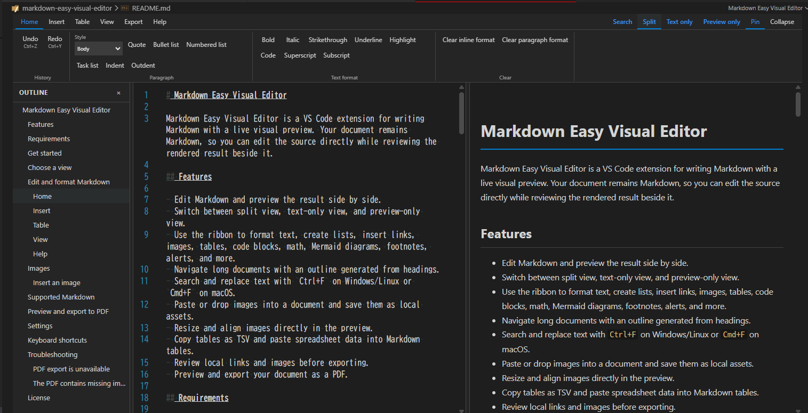
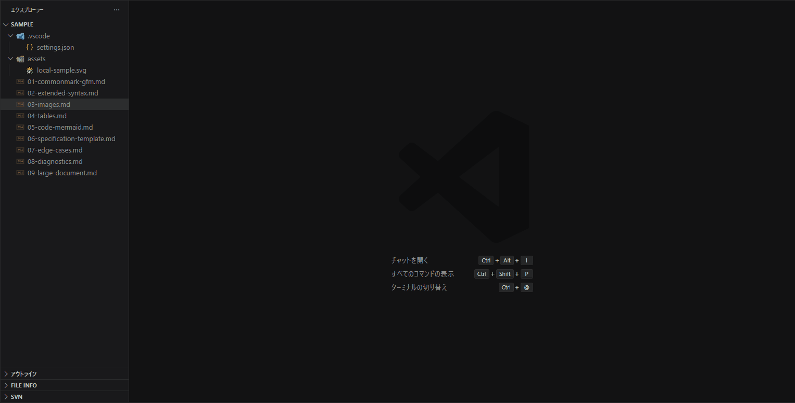
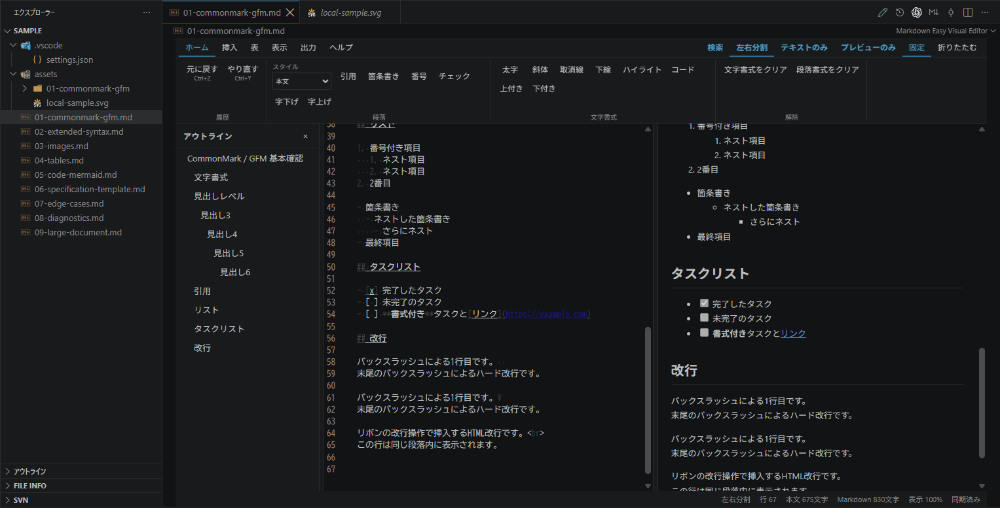
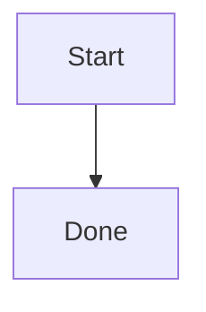
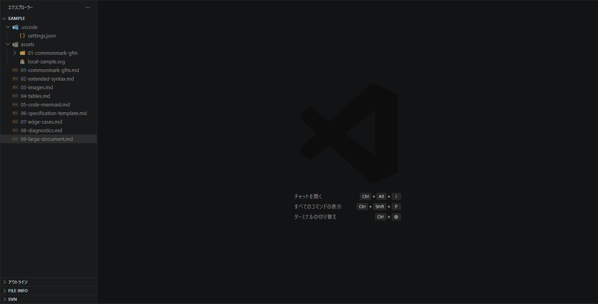
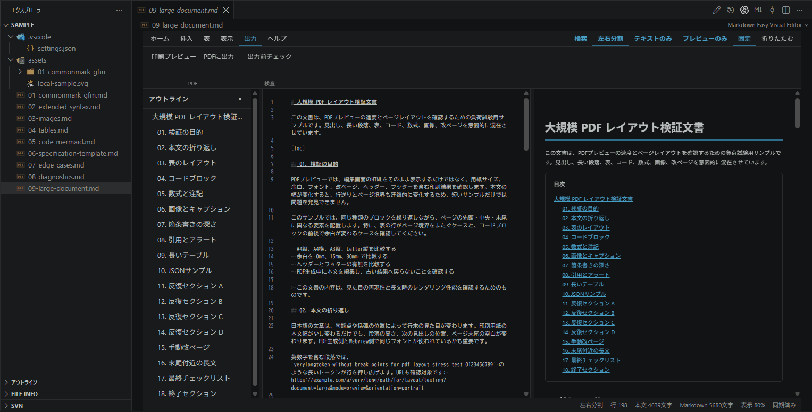

# Markdown Easy Visual Editor

Markdown Easy Visual Editor is a VS Code extension for writing Markdown with a live visual preview. Your document remains Markdown, so you can edit the source directly while reviewing the rendered result beside it.



## Features

- Edit Markdown and preview the result side by side.
- Switch between split view, text-only view, and preview-only view.
- Use the ribbon to format text, create lists, insert links, images, tables, code blocks, math, Mermaid diagrams, footnotes, alerts, and more.
- Navigate long documents with an outline generated from headings.
- Search and replace text with `Ctrl+F` on Windows/Linux or `Cmd+F` on macOS.
- Paste or drop images into a document and save them as local assets.
- Resize and align images directly in the preview.
- Copy tables as TSV and paste spreadsheet data into Markdown tables.
- Edit Markdown tables in a spreadsheet-like table editor, including direct cell editing, row and column operations, column-width and row-height adjustment, and moving or resizing the editor.
- Review local links and images before exporting.
- Preview and export your document as a PDF.
- Export your document as HTML, with options for images and linked Markdown files.

## Requirements

- Visual Studio Code 1.100 or later.
- A local, saved Markdown document for image insertion.
- A trusted VS Code workspace for PDF and HTML export.

## Get started

1. Open a folder containing a `.md` or `.markdown` file in VS Code.
2. Open the Markdown file.
3. If it opens as a regular text editor, right-click the file and choose **Open With > Markdown Easy Visual Editor**. You can also run **Markdown Easy Visual Editor: Open in visual editor** from the Command Palette.
4. Edit the document in the text pane and review the result in the preview pane.
5. Save the document with `Ctrl+S` (`Cmd+S` on macOS).

## Choose a view

The view buttons at the top of the editor provide three layouts:

- **Split**: show the Markdown source and preview together.
- **Text only**: focus on the Markdown source.
- **Preview only**: read the rendered document without the editing pane.

Use **View > Outline** to show or hide the heading outline. Select a heading in the outline to jump to that section. Use **Ctrl+wheel** or **Cmd+wheel** to zoom the editor and preview.

The ribbon can be pinned or collapsed when you need more space for your document.

### Reorder sections from the outline

Right-click and drag an outline item to reorder the corresponding Markdown section. The dragged heading and all of its descendants move together. A drop position is shown before or after the target heading.

The heading level must not change during a move:

- A parent can be moved to another parent at the same heading level, together with all of its children.
- A child can be moved to another parent when it remains at the same heading level. Its descendants move with it.
- A child can be dropped on a parent with no child headings. It becomes the first child of that parent without changing its heading level.
- Moves between different heading levels, such as moving a `#` heading onto a `##` heading, are not allowed.

For example, moving `# A` after `# B` carries the entire `# A` section:

```text
Before:                 After:
# A                     # B
## A-1                  ## B-1
# B                     # A
## B-1                  ## A-1
```

Moving `## A-1` after `## B-1` changes its parent while keeping it a level-2 heading:

```text
Before:                 After:
# A                     # A
## A-1                  # B
# B                     ## B-1
## B-1                  ## A-1
```

Undo and redo can be used after a successful outline move. Left-clicking an outline item continues to navigate to that heading.

## Edit and format Markdown

The ribbon is organized into tabs so common actions are easy to find.

### Home



Apply headings, quotes, bullet lists, numbered lists, task lists, indentation, and text formatting such as bold, italic, strikethrough, underline, highlight, inline code, superscript, and subscript.

### Insert

Insert links, images, tables, horizontal rules, line breaks, code blocks, mathematical expressions, footnotes, tables of contents, page breaks, callouts, and emoji. When inserting a code block, choose its language to enable syntax highlighting.

### Table

Place the cursor inside a Markdown table to:

- Open the table editor and edit cells directly.
- Add or delete rows and columns.
- Toggle the header row.
- Align cells left, center, or right.
- Drag column boundaries to adjust column widths and row-header boundaries to adjust an entire row's height.
- Drag the title bar to move the table editor or the bottom-right corner to resize it.
- Set a header name when adding a column.
- Copy the table as tab-separated values with **Copy as TSV**.

To bring spreadsheet data into Markdown, copy the cells and paste them into the editor. The data is inserted as a Markdown table or added to the table at the cursor position.

Press `Alt+Enter` inside a table cell to insert a line break in that cell.

### View

Open the same Markdown document as a regular text editor beside the visual editor, toggle the outline, and adjust the viewing layout.

### Help

Open **Shortcuts** for the built-in keyboard shortcut list, or open **Features** for a quick overview of the available editing tools.

## Images

### Insert an image



Save the Markdown document first, then use any of these methods while the source editor is editable:

- Paste an image with `Ctrl+V` or `Cmd+V`.
- Drag an image file into the editor.
- Choose **Insert > Image** and select an image file.

The extension saves pasted and selected images locally and inserts a relative Markdown reference into the document. By default, images are stored in:

```text
assets/<document-name>/
```

When a preview is visible, select an image to inspect its alt text and reference. You can also drag its resize handle or use the alignment controls. Changes are written back to the Markdown source.

PNG, JPEG, GIF, WebP, BMP, and SVG images are supported. BMP images are converted to PNG when they are saved.

Remote images can be displayed when **Markdown Easy Visual Editor: Remote Images Enabled** is enabled in VS Code settings.

## Supported Markdown

The renderer follows CommonMark and GitHub Flavored Markdown (GFM) conventions and supports:

- Headings and heading-based outlines
- Bullet lists, numbered lists, and task lists
- Tables and table alignment
- Links and images
- Strikethrough, highlights, and underlines
- Footnotes
- Table of contents markers
- Fenced code blocks with syntax highlighting
- Mathematical expressions
- Mermaid diagrams
- Note, tip, important, warning, and caution callouts
- Page breaks

For example, a Mermaid diagram can be written as:




## Preview and export to PDF



1. Open the **Export** tab.
2. Choose **Print preview**.
3. Select the paper size: A4, A3, or Letter.
4. Select portrait or landscape orientation.
5. Optionally enter a header and footer and adjust the margins.
6. Choose **Export PDF**.
7. Select the destination, or enable **Export to the same folder without a dialog** in the print settings.

- Use **Preflight check** before exporting to review missing local images, missing local links, invalid tables, and other document issues that may affect the result.\

- PDF export requires a trusted workspace and Microsoft Edge or Google Chrome. The extension first tries Microsoft Edge and then Google Chrome. If neither browser is detected, set **Markdown Easy Visual Editor: PDF Browser Path** in VS Code settings to the executable path of Edge or Chrome.

## Export to HTML

The **Export** tab can convert the current Markdown document to HTML.

1. Open the **Export** tab.
2. Choose the HTML options:
   - **Embed images in HTML**: embed local images as data URLs, or leave them as relative paths when unchecked.
   - **Convert linked Markdown**: recursively convert local links to other Markdown files and update the links to their generated HTML files.
   - **Export directly to the same folder**: save the HTML beside the source Markdown file without showing a save dialog. This option is enabled by default.
3. Choose **Export HTML**.

When linked Markdown conversion is enabled, each linked Markdown file is also written as an HTML file in the corresponding location. Mermaid diagrams are rendered as SVG in the generated HTML. HTML export requires a trusted workspace.

## Export from the VS Code Explorer

You can export a `.md` or `.markdown` file directly from the VS Code Explorer:

1. Right-click the Markdown file in the Explorer.
2. Select **Markdown Easy Visual Editor: Export PDF** or **Markdown Easy Visual Editor: Export HTML**.

If the file is not already open in Markdown Easy Visual Editor, the extension opens it automatically, waits for the editor and preview to initialize, and then starts the export. Explorer exports use exactly the same Markdown conversion, preview rendering, Mermaid rendering, CSS, and export pipeline as the buttons in the **Export** tab. The entry point therefore does not change the generated PDF or HTML output.

By default, the exported file is saved beside the source Markdown file as `<name>.pdf` or `<name>.html`, using the same default export options as the editor UI.

## Settings

Open VS Code Settings and search for **Markdown Easy Visual Editor**.

| Setting | Purpose | Default |
| --- | --- | --- |
| **Language** | Choose the editor language or follow the VS Code display language. | Auto |
| **Images: Directory** | Choose where locally saved images are stored. `${documentBasename}` uses the current Markdown file name. | `assets/${documentBasename}` |
| **Images: Maximum Paste Size (MB)** | Set the maximum size of each pasted image. | `100` |
| **Remote Images: Enabled** | Allow images referenced by remote URLs to appear in the preview. | Enabled |
| **Mermaid: Theme** | Choose the Mermaid preview theme. | Auto |
| **PDF: Browser Path** | Specify an Edge or Chrome executable when automatic detection does not work. | Automatic detection |

## Keyboard shortcuts

| Shortcut | Action |
| --- | --- |
| `Ctrl+F` / `Cmd+F` | Open search and replace. |
| `Ctrl+V` / `Cmd+V` | Paste text, or save and insert an image when the clipboard contains one. |
| `Alt+Enter` | Insert a line break inside a table cell. |
| `Ctrl+wheel` / `Cmd+wheel` | Zoom the editor and preview. |

## Troubleshooting

### PDF export is unavailable

Trust the current workspace, then try **Export > Print preview** again. If Edge and Chrome cannot be found, set **PDF: Browser Path** to the executable path of either browser.

### The PDF contains missing images or links

Run **Export > Preflight check** and confirm that every relative image and link points to a file that exists next to the Markdown document.

## License

Licensed under MIT
