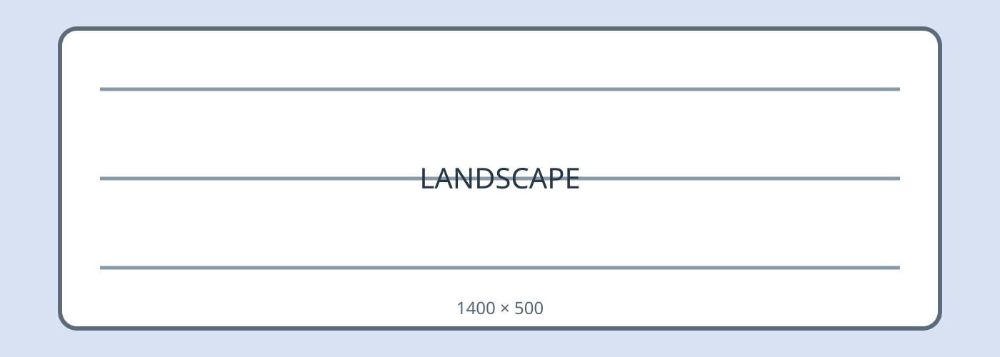
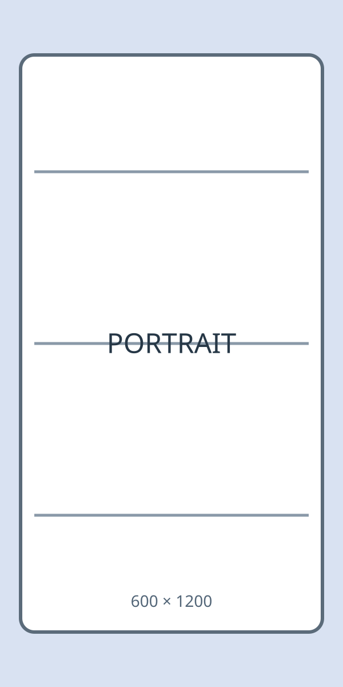
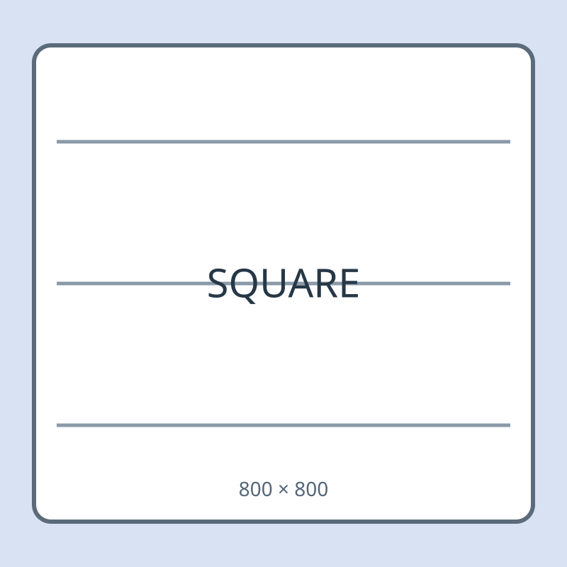
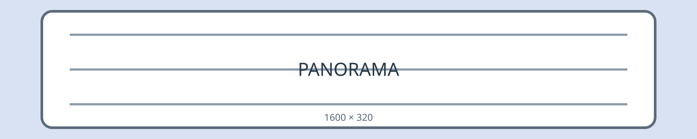
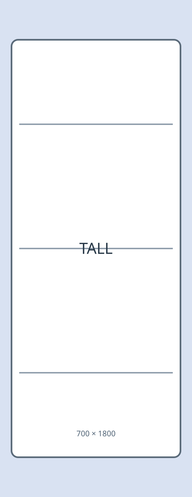

# Image Scroll Synchronization Stress Sample

> Purpose: compare split-view scroll synchronization with many repository-local images of very different aspect ratios.

Use a roughly 50/50 split. Scroll from both panes, reverse direction while a tall image is visible, and compare the marker numbers on the left and right.

## Section 01

SECTION-01-START — ordinary text before the image group. The same marker should remain near the same vertical position in both panes.

### Marker 01-01

BEFORE-01-01 — text immediately before the landscape image.

AFTER-01-01 — text immediately after the image. Reverse scroll direction around this boundary during comparison.

### Marker 01-02

BEFORE-01-02 — text immediately before the portrait image.

AFTER-01-02 — text immediately after the image. Reverse scroll direction around this boundary during comparison.

### Marker 01-03

BEFORE-01-03 — text immediately before the square image.

AFTER-01-03 — text immediately after the image. Reverse scroll direction around this boundary during comparison.

### Marker 01-04

BEFORE-01-04 — text immediately before the panorama image.

AFTER-01-04 — text immediately after the image. Reverse scroll direction around this boundary during comparison.

### Marker 01-05

BEFORE-01-05 — text immediately before the tall image.

AFTER-01-05 — text immediately after the image. Reverse scroll direction around this boundary during comparison.

SECTION-01-END — end of this image group.

## Section 02

SECTION-02-START — ordinary text before the image group. The same marker should remain near the same vertical position in both panes.

### Marker 02-01

BEFORE-02-01 — text immediately before the landscape image.

AFTER-02-01 — text immediately after the image. Reverse scroll direction around this boundary during comparison.

### Marker 02-02

BEFORE-02-02 — text immediately before the portrait image.

AFTER-02-02 — text immediately after the image. Reverse scroll direction around this boundary during comparison.

### Marker 02-03

BEFORE-02-03 — text immediately before the square image.

AFTER-02-03 — text immediately after the image. Reverse scroll direction around this boundary during comparison.

### Marker 02-04

BEFORE-02-04 — text immediately before the panorama image.

AFTER-02-04 — text immediately after the image. Reverse scroll direction around this boundary during comparison.

### Marker 02-05

BEFORE-02-05 — text immediately before the tall image.

AFTER-02-05 — text immediately after the image. Reverse scroll direction around this boundary during comparison.

SECTION-02-END — end of this image group.

## Section 03

SECTION-03-START — ordinary text before the image group. The same marker should remain near the same vertical position in both panes.

### Marker 03-01

BEFORE-03-01 — text immediately before the landscape image.

AFTER-03-01 — text immediately after the image. Reverse scroll direction around this boundary during comparison.

### Marker 03-02

BEFORE-03-02 — text immediately before the portrait image.

AFTER-03-02 — text immediately after the image. Reverse scroll direction around this boundary during comparison.

### Marker 03-03

BEFORE-03-03 — text immediately before the square image.

AFTER-03-03 — text immediately after the image. Reverse scroll direction around this boundary during comparison.

### Marker 03-04

BEFORE-03-04 — text immediately before the panorama image.

AFTER-03-04 — text immediately after the image. Reverse scroll direction around this boundary during comparison.

### Marker 03-05

BEFORE-03-05 — text immediately before the tall image.

AFTER-03-05 — text immediately after the image. Reverse scroll direction around this boundary during comparison.

SECTION-03-END — end of this image group.

## Section 04

SECTION-04-START — ordinary text before the image group. The same marker should remain near the same vertical position in both panes.

### Marker 04-01

BEFORE-04-01 — text immediately before the landscape image.

AFTER-04-01 — text immediately after the image. Reverse scroll direction around this boundary during comparison.

### Marker 04-02

BEFORE-04-02 — text immediately before the portrait image.

AFTER-04-02 — text immediately after the image. Reverse scroll direction around this boundary during comparison.

### Marker 04-03

BEFORE-04-03 — text immediately before the square image.

AFTER-04-03 — text immediately after the image. Reverse scroll direction around this boundary during comparison.

### Marker 04-04

BEFORE-04-04 — text immediately before the panorama image.

AFTER-04-04 — text immediately after the image. Reverse scroll direction around this boundary during comparison.

### Marker 04-05

BEFORE-04-05 — text immediately before the tall image.

AFTER-04-05 — text immediately after the image. Reverse scroll direction around this boundary during comparison.

SECTION-04-END — end of this image group.

## Section 05

SECTION-05-START — ordinary text before the image group. The same marker should remain near the same vertical position in both panes.

### Marker 05-01

BEFORE-05-01 — text immediately before the landscape image.

AFTER-05-01 — text immediately after the image. Reverse scroll direction around this boundary during comparison.

### Marker 05-02

BEFORE-05-02 — text immediately before the portrait image.

AFTER-05-02 — text immediately after the image. Reverse scroll direction around this boundary during comparison.

### Marker 05-03

BEFORE-05-03 — text immediately before the square image.

AFTER-05-03 — text immediately after the image. Reverse scroll direction around this boundary during comparison.

### Marker 05-04

BEFORE-05-04 — text immediately before the panorama image.

AFTER-05-04 — text immediately after the image. Reverse scroll direction around this boundary during comparison.

### Marker 05-05

BEFORE-05-05 — text immediately before the tall image.

AFTER-05-05 — text immediately after the image. Reverse scroll direction around this boundary during comparison.

SECTION-05-END — end of this image group.

## Section 06

SECTION-06-START — ordinary text before the image group. The same marker should remain near the same vertical position in both panes.

### Marker 06-01

BEFORE-06-01 — text immediately before the landscape image.

AFTER-06-01 — text immediately after the image. Reverse scroll direction around this boundary during comparison.

### Marker 06-02

BEFORE-06-02 — text immediately before the portrait image.

AFTER-06-02 — text immediately after the image. Reverse scroll direction around this boundary during comparison.

### Marker 06-03

BEFORE-06-03 — text immediately before the square image.

AFTER-06-03 — text immediately after the image. Reverse scroll direction around this boundary during comparison.

### Marker 06-04

BEFORE-06-04 — text immediately before the panorama image.

AFTER-06-04 — text immediately after the image. Reverse scroll direction around this boundary during comparison.

### Marker 06-05

BEFORE-06-05 — text immediately before the tall image.

AFTER-06-05 — text immediately after the image. Reverse scroll direction around this boundary during comparison.

SECTION-06-END — end of this image group.

## Section 07

SECTION-07-START — ordinary text before the image group. The same marker should remain near the same vertical position in both panes.

### Marker 07-01

BEFORE-07-01 — text immediately before the landscape image.

AFTER-07-01 — text immediately after the image. Reverse scroll direction around this boundary during comparison.

### Marker 07-02

BEFORE-07-02 — text immediately before the portrait image.

AFTER-07-02 — text immediately after the image. Reverse scroll direction around this boundary during comparison.

### Marker 07-03

BEFORE-07-03 — text immediately before the square image.

AFTER-07-03 — text immediately after the image. Reverse scroll direction around this boundary during comparison.

### Marker 07-04

BEFORE-07-04 — text immediately before the panorama image.

AFTER-07-04 — text immediately after the image. Reverse scroll direction around this boundary during comparison.

### Marker 07-05

BEFORE-07-05 — text immediately before the tall image.

AFTER-07-05 — text immediately after the image. Reverse scroll direction around this boundary during comparison.

SECTION-07-END — end of this image group.

## Section 08

SECTION-08-START — ordinary text before the image group. The same marker should remain near the same vertical position in both panes.

### Marker 08-01

BEFORE-08-01 — text immediately before the landscape image.

AFTER-08-01 — text immediately after the image. Reverse scroll direction around this boundary during comparison.

### Marker 08-02

BEFORE-08-02 — text immediately before the portrait image.

AFTER-08-02 — text immediately after the image. Reverse scroll direction around this boundary during comparison.

### Marker 08-03

BEFORE-08-03 — text immediately before the square image.

AFTER-08-03 — text immediately after the image. Reverse scroll direction around this boundary during comparison.

### Marker 08-04

BEFORE-08-04 — text immediately before the panorama image.

AFTER-08-04 — text immediately after the image. Reverse scroll direction around this boundary during comparison.

### Marker 08-05

BEFORE-08-05 — text immediately before the tall image.

AFTER-08-05 — text immediately after the image. Reverse scroll direction around this boundary during comparison.

SECTION-08-END — end of this image group.
