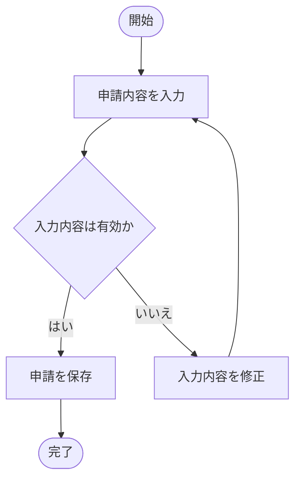

# フローチャートの基本

処理の開始、入力、判定、終了を縦方向に並べる例です。

```mermaid
flowchart TD
    Start([開始]) --> Input[申請内容を入力]
    Input --> Check{入力内容は有効か}
    Check -->|はい| Save[申請を保存]
    Check -->|いいえ| Fix[入力内容を修正]
    Fix --> Input
    Save --> Done([完了])
```
