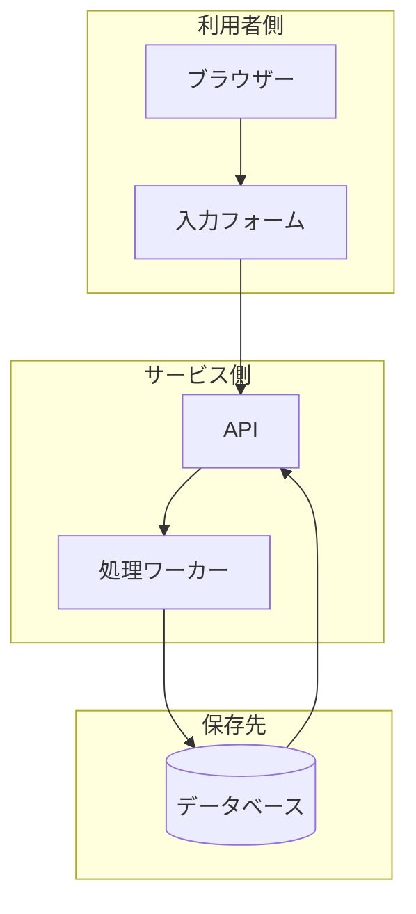

# フローチャートのサブグラフ

サブグラフ内の方向指定と、グループ間を結ぶ矢印の例です。

```mermaid
flowchart TB
    subgraph Client[利用者側]
        direction LR
        Browser[ブラウザー] --> Form[入力フォーム]
    end

    subgraph Service[サービス側]
        direction LR
        Api[API] --> Worker[処理ワーカー]
    end

    subgraph Storage[保存先]
        Database[(データベース)]
    end

    Form --> Api
    Worker --> Database
    Database --> Api
```
