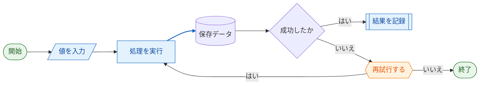

# フローチャートの図形とスタイル

代表的な図形、ノードのクラス、線のスタイルをまとめています。

```mermaid
flowchart LR
    Start([開始]) --> Input[/値を入力/]
    Input --> Process[処理を実行]
    Process --> Data[(保存データ)]
    Data --> Decision{成功したか}
    Decision -->|はい| Document[[結果を記録]]
    Decision -->|いいえ| Retry{{再試行する}}
    Retry -->|はい| Process
    Retry -->|いいえ| End([終了])

    classDef entry fill:#e8f5e9,stroke:#2e7d32,color:#1b5e20
    classDef action fill:#e3f2fd,stroke:#1565c0,color:#0d47a1
    classDef warning fill:#fff3e0,stroke:#ef6c00,color:#e65100
    class Start,End entry
    class Input,Process,Document action
    class Retry warning
    linkStyle 2 stroke:#1565c0,stroke-width:2px
```
