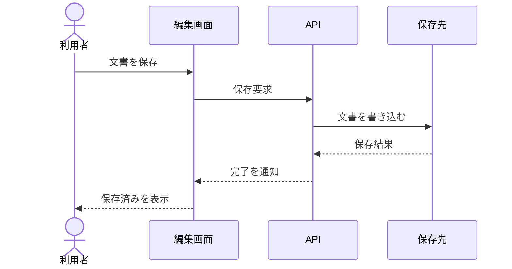

# シーケンス図の基本

利用者、画面、API、保存先の要求と応答を示します。

```mermaid
sequenceDiagram
    actor User as 利用者
    participant UI as 編集画面
    participant API as API
    participant DB as 保存先

    User->>UI: 文書を保存
    UI->>API: 保存要求
    API->>DB: 文書を書き込む
    DB-->>API: 保存結果
    API-->>UI: 完了を通知
    UI-->>User: 保存済みを表示
```
