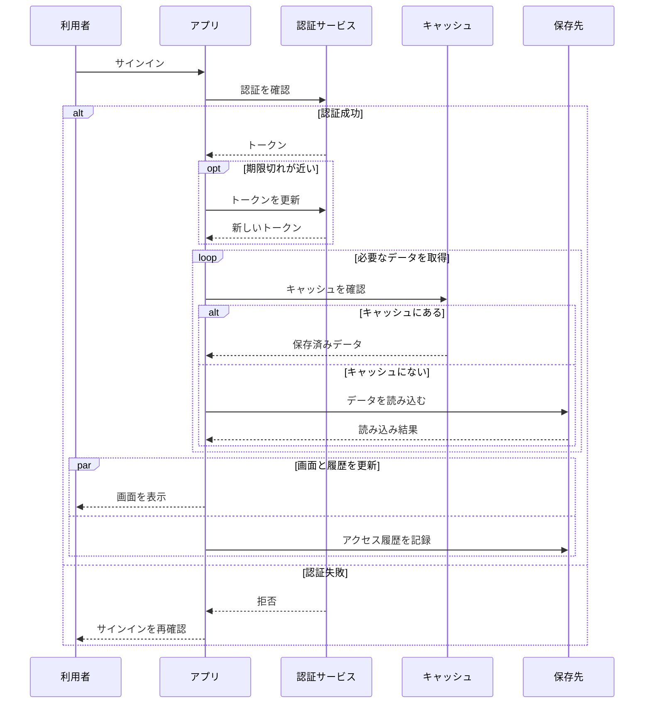

# シーケンス図の条件と並行処理

条件分岐、任意処理、繰り返し、並行処理の表記例です。

```mermaid
sequenceDiagram
    participant User as 利用者
    participant App as アプリ
    participant Auth as 認証サービス
    participant Cache as キャッシュ
    participant Store as 保存先

    User->>App: サインイン
    App->>Auth: 認証を確認
    alt 認証成功
        Auth-->>App: トークン
        opt 期限切れが近い
            App->>Auth: トークンを更新
            Auth-->>App: 新しいトークン
        end
        loop 必要なデータを取得
            App->>Cache: キャッシュを確認
            alt キャッシュにある
                Cache-->>App: 保存済みデータ
            else キャッシュにない
                App->>Store: データを読み込む
                Store-->>App: 読み込み結果
            end
        end
        par 画面と履歴を更新
            App-->>User: 画面を表示
        and
            App->>Store: アクセス履歴を記録
        end
    else 認証失敗
        Auth-->>App: 拒否
        App-->>User: サインインを再確認
    end
```
