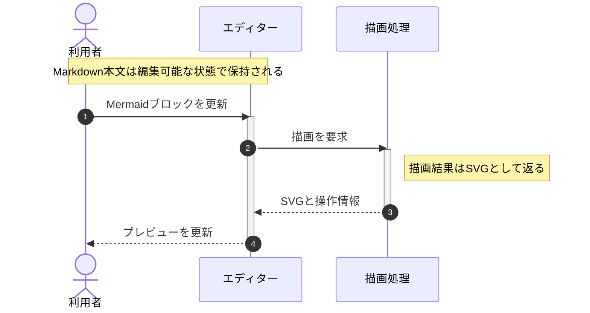

# シーケンス図の注記と実行区間

自動採番、注記、実行区間を加えて処理の境界を示します。

```mermaid
sequenceDiagram
    autonumber
    actor User as 利用者
    participant Editor as エディター
    participant Renderer as 描画処理

    Note over User,Editor: Markdown本文は編集可能な状態で保持される
    User->>Editor: Mermaidブロックを更新
    activate Editor
    Editor->>Renderer: 描画を要求
    activate Renderer
    Note right of Renderer: 描画結果はSVGとして返る
    Renderer-->>Editor: SVGと操作情報
    deactivate Renderer
    Editor-->>User: プレビューを更新
    deactivate Editor
```
