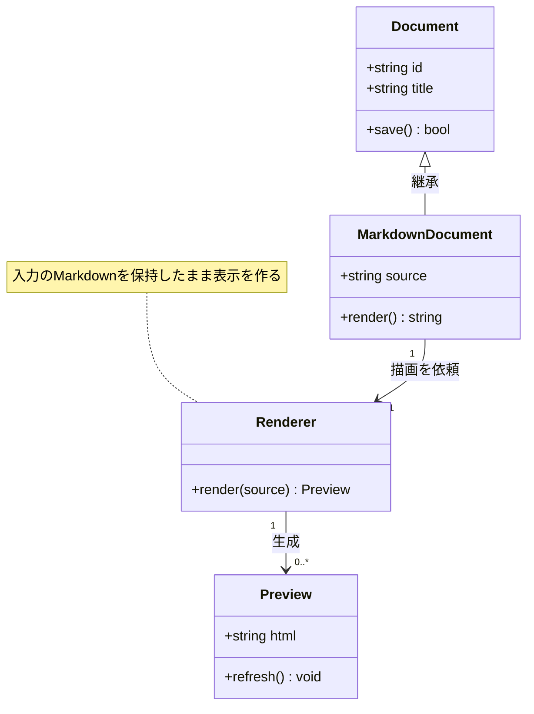

# クラス図

属性、操作、継承、関連、多重度、注記を含むクラス図です。

```mermaid
classDiagram
    class Document {
        +string id
        +string title
        +save() bool
    }
    class MarkdownDocument {
        +string source
        +render() string
    }
    class Renderer {
        +render(source) Preview
    }
    class Preview {
        +string html
        +refresh() void
    }

    Document <|-- MarkdownDocument : 継承
    MarkdownDocument "1" --> "1" Renderer : 描画を依頼
    Renderer "1" --> "0..*" Preview : 生成
    note for Renderer "入力のMarkdownを保持したまま表示を作る"
```
