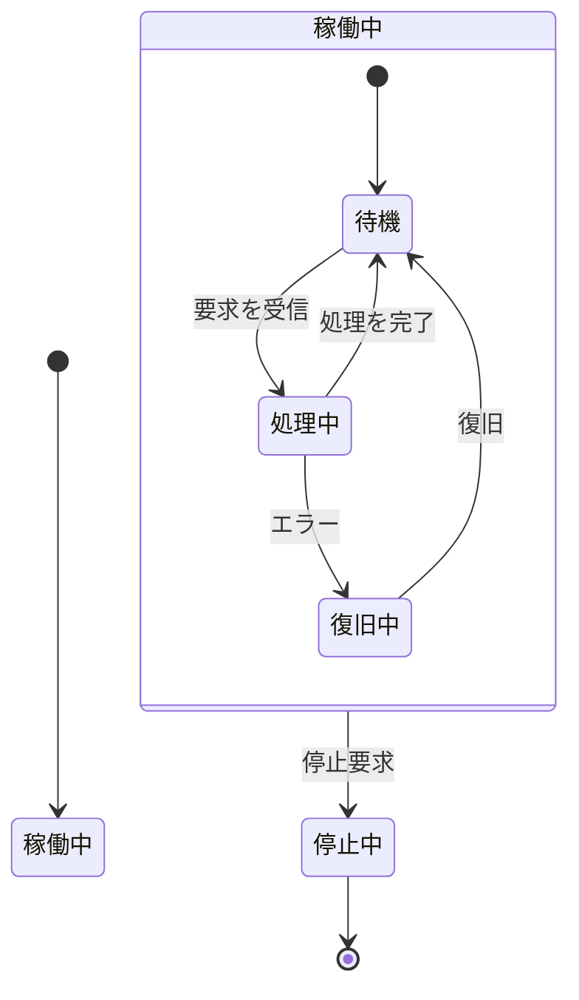

# 状態遷移図の複合状態

複合状態の内部に複数の状態を定義する例です。

```mermaid
stateDiagram-v2
    [*] --> 稼働中
    state "稼働中" as Active {
        [*] --> 待機
        待機 --> 処理中: 要求を受信
        処理中 --> 待機: 処理を完了
        処理中 --> 復旧中: エラー
        復旧中 --> 待機: 復旧
    }
    Active --> 停止中: 停止要求
    停止中 --> [*]
```
