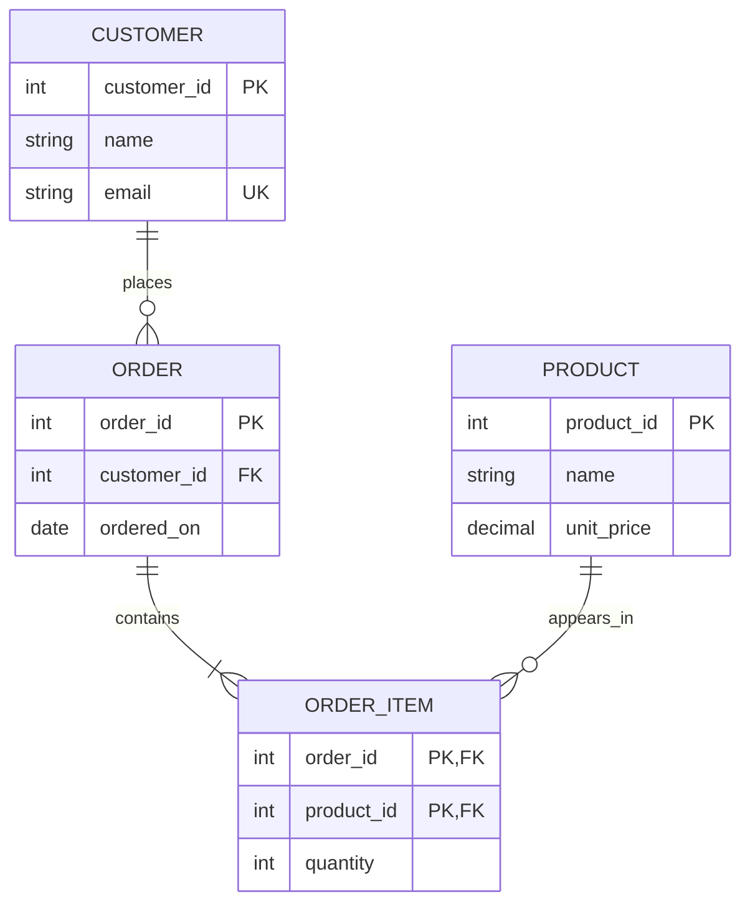

# ER 図

エンティティの属性と、代表的なカーディナリティを示します。

```mermaid
erDiagram
    CUSTOMER ||--o{ ORDER : places
    ORDER ||--|{ ORDER_ITEM : contains
    PRODUCT ||--o{ ORDER_ITEM : appears_in
    CUSTOMER {
        int customer_id PK
        string name
        string email UK
    }
    ORDER {
        int order_id PK
        int customer_id FK
        date ordered_on
    }
    ORDER_ITEM {
        int order_id PK, FK
        int product_id PK, FK
        int quantity
    }
    PRODUCT {
        int product_id PK
        string name
        decimal unit_price
    }
```
