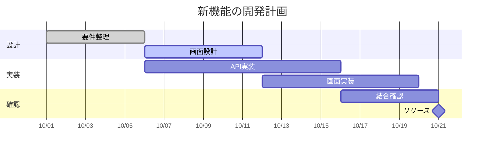

# ガントチャートの基本

担当区分、期間、進捗状態を使った計画表です。

```mermaid
gantt
    title 新機能の開発計画
    dateFormat YYYY-MM-DD
    axisFormat %m/%d
    section 設計
        要件整理 :done, req, 2026-10-01, 5d
        画面設計 :active, ui, after req, 6d
    section 実装
        API実装 :api, after req, 10d
        画面実装 :front, after ui, 8d
    section 確認
        結合確認 :test, after api, 5d
        リリース :milestone, release, after test, 0d
```
