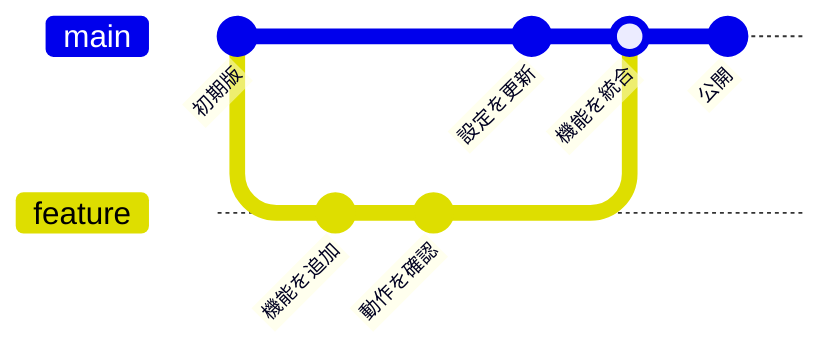

# Git グラフ

ブランチの作成、並行作業、マージを示します。

```mermaid
gitGraph LR:
    commit id: "初期版"
    branch feature
    checkout feature
    commit id: "機能を追加"
    commit id: "動作を確認"
    checkout main
    commit id: "設定を更新"
    merge feature id: "機能を統合"
    commit id: "公開"
```
