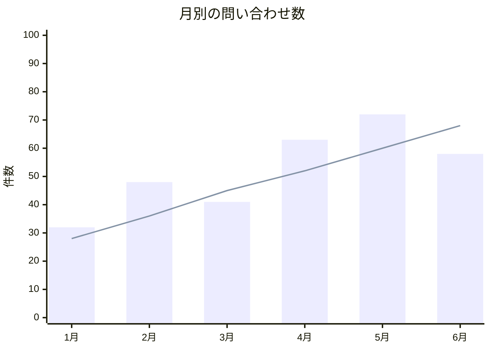

# XY チャート

棒グラフと折れ線を同じ座標軸に重ねる例です。

```mermaid
xychart
    title "月別の問い合わせ数"
    x-axis ["1月", "2月", "3月", "4月", "5月", "6月"]
    y-axis "件数" 0 --> 100
    bar [32, 48, 41, 63, 72, 58]
    line [28, 36, 45, 52, 60, 68]
```
