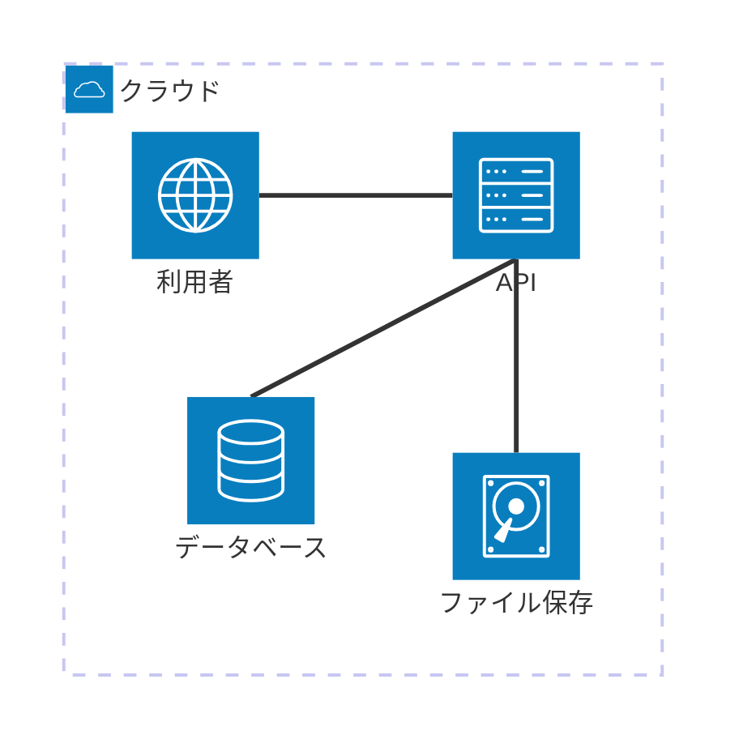

# アーキテクチャ図

サービス、グループ、接続の位置関係を示します。

```mermaid
architecture-beta
    group cloud(cloud)["クラウド"]
    service client(internet)["利用者"] in cloud
    service api(server)["API"] in cloud
    service database(database)["データベース"] in cloud
    service files(disk)["ファイル保存"] in cloud

    client:R -- L:api
    api:B -- T:database
    api:B -- T:files
```
