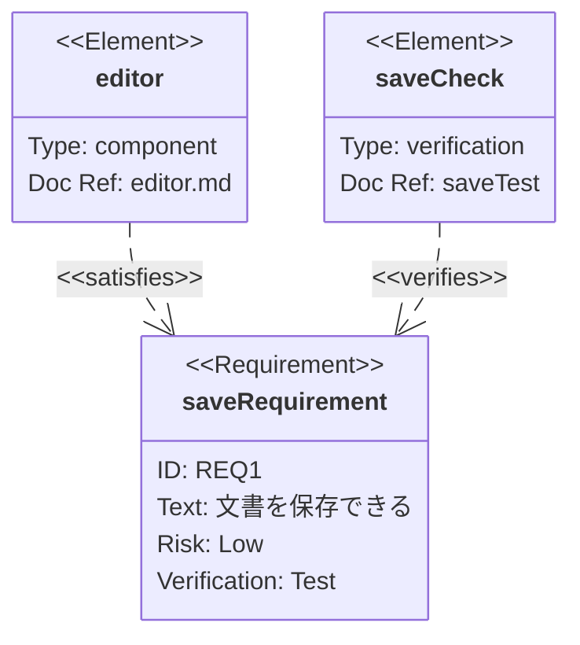

# 要求図

要求、実装要素、検証要素の関係を示します。

```mermaid
requirementDiagram
    requirement saveRequirement {
        id: REQ1
        text: "文書を保存できる"
        risk: Low
        verifymethod: test
    }
    element editor {
        type: component
        docref: editor.md
    }
    element saveCheck {
        type: verification
        docref: saveTest
    }

    editor - satisfies -> saveRequirement
    saveCheck - verifies -> saveRequirement
```
