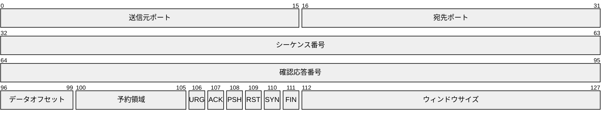

# パケット図

ビット範囲ごとに、パケットのフィールドを並べます。

```mermaid
packet
    0-15: "送信元ポート"
    16-31: "宛先ポート"
    32-63: "シーケンス番号"
    64-95: "確認応答番号"
    96-99: "データオフセット"
    100-105: "予約領域"
    106: "URG"
    107: "ACK"
    108: "PSH"
    109: "RST"
    110: "SYN"
    111: "FIN"
    112-127: "ウィンドウサイズ"
```
