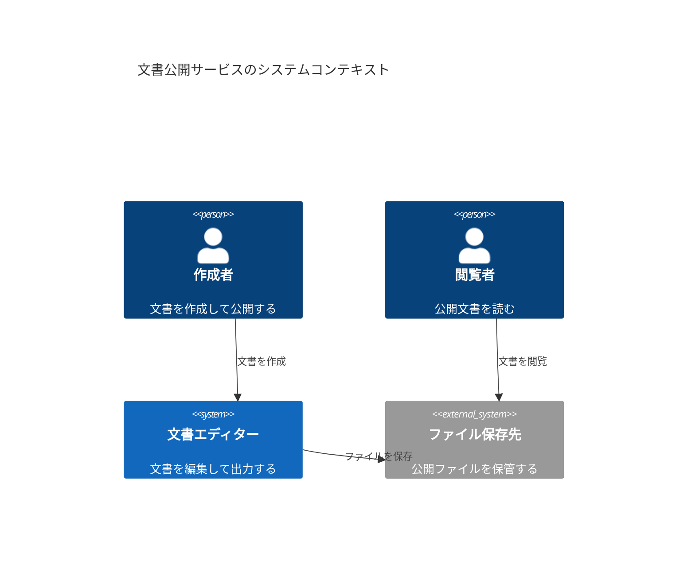

# C4 コンテキスト図

利用者、対象システム、外部システムの関係を示します。

```mermaid
C4Context
    title 文書公開サービスのシステムコンテキスト
    Person(author, "作成者", "文書を作成して公開する")
    Person(reader, "閲覧者", "公開文書を読む")
    System(editor, "文書エディター", "文書を編集して出力する")
    System_Ext(storage, "ファイル保存先", "公開ファイルを保管する")
    Rel(author, editor, "文書を作成")
    Rel(editor, storage, "ファイルを保存")
    Rel(reader, storage, "文書を閲覧")
```
