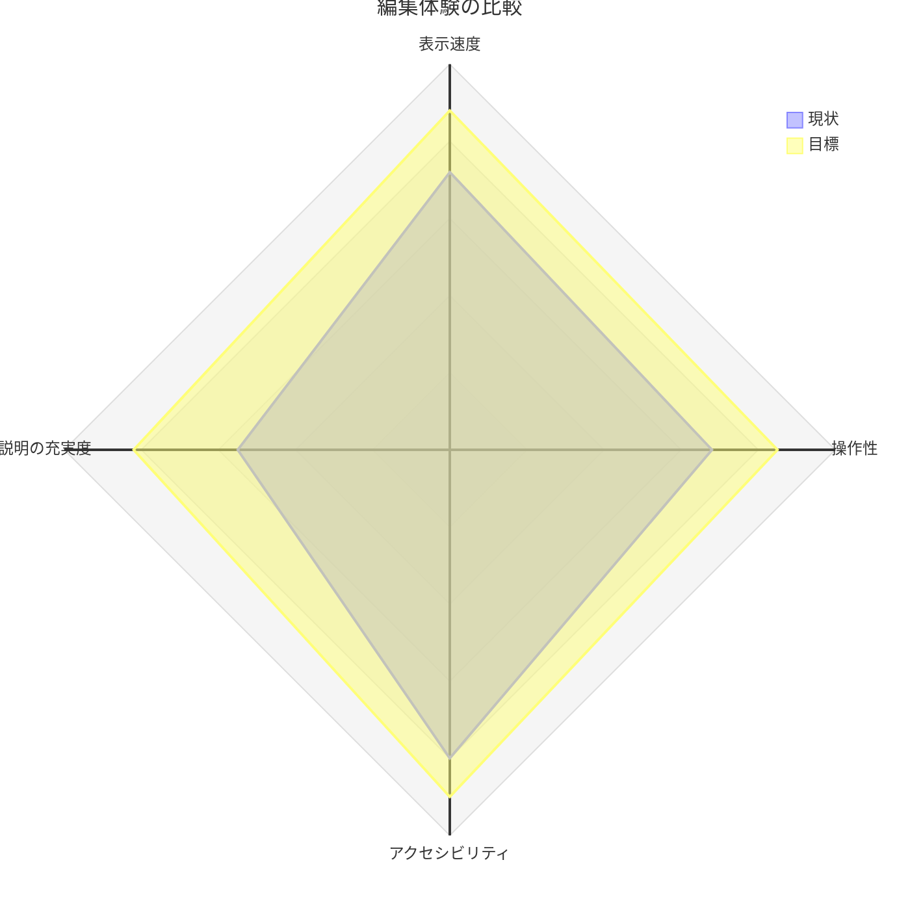

# レーダーチャート

複数の評価軸に対する値を、複数の系列で比較します。

```mermaid
radar-beta
    title 編集体験の比較
    axis speed["表示速度"], ease["操作性"]
    axis access["アクセシビリティ"], docs["説明の充実度"]
    curve current["現状"]{72, 68, 80, 55}
    curve target["目標"]{88, 85, 90, 82}
    min 0
    max 100
    graticule polygon
```
