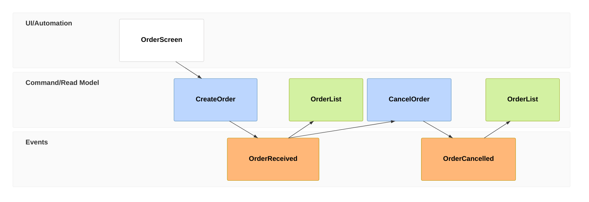

# イベントモデリング

時間軸に沿って、コマンド、イベント、読み取りモデルを配置します。

```mermaid
eventmodeling
    tf 01 ui OrderScreen
    tf 02 cmd CreateOrder
    tf 03 evt OrderReceived
    tf 04 rmo OrderList
    tf 05 cmd CancelOrder
    tf 06 evt OrderCancelled
    tf 07 rmo OrderList
```
