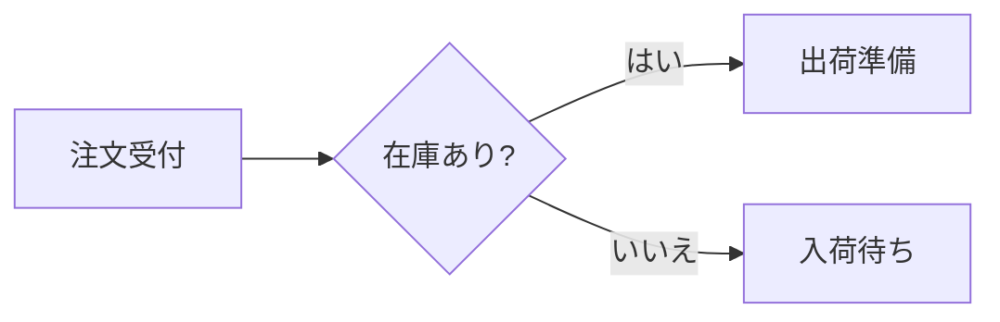
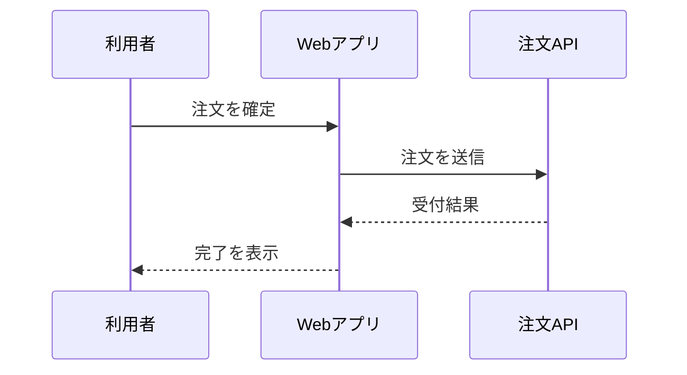

# Marpスライド内のMermaid

Mermaidコードフェンスはプレビューで図として描画されます。

```mermaid
flowchart LR
    A[注文受付] --> B{在庫あり?}
    B -->|はい| C[出荷準備]
    B -->|いいえ| D[入荷待ち]
```

---

# API呼び出し

シーケンス図も同じようにスライド内へ配置できます。

```mermaid
sequenceDiagram
    participant U as 利用者
    participant W as Webアプリ
    participant A as 注文API
    U->>W: 注文を確定
    W->>A: 注文を送信
    A-->>W: 受付結果
    W-->>U: 完了を表示
```
