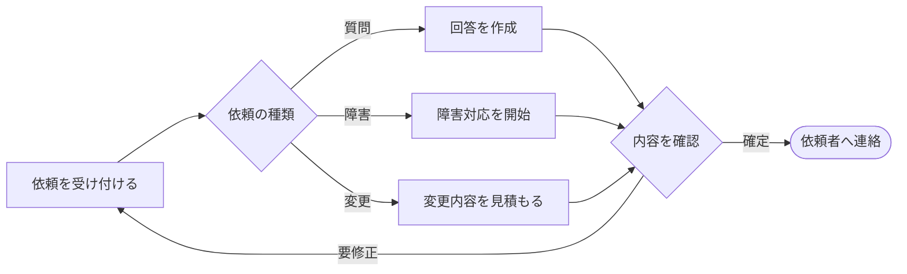

# Marp: フローチャートの分岐

Marpスライド内でPeleが描画するMermaidサンプルです。

複数の条件分岐と、各経路が合流する形を示します。

```mermaid
flowchart LR
    Request[依頼を受け付ける] --> Type{依頼の種類}
    Type -->|質問| Answer[回答を作成]
    Type -->|障害| Incident[障害対応を開始]
    Type -->|変更| Change[変更内容を見積もる]
    Answer --> Review{内容を確認}
    Incident --> Review
    Change --> Review
    Review -->|要修正| Request
    Review -->|確定| Publish([依頼者へ連絡])
```
