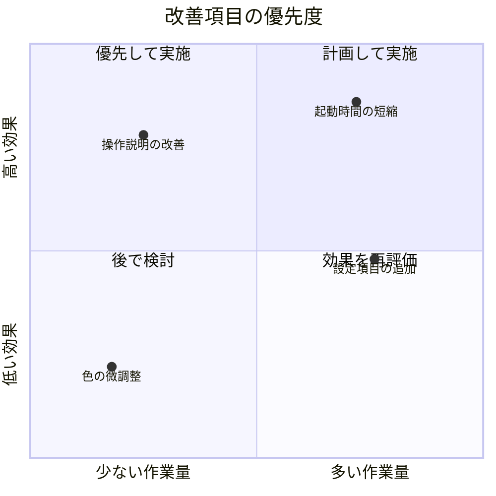

# Marp: クアドラントチャート

Marpスライド内でPeleが描画するMermaidサンプルです。

重要度と作業量の二軸で、対応項目を四つの領域に配置します。

```mermaid
quadrantChart
    title 改善項目の優先度
    x-axis 少ない作業量 --> 多い作業量
    y-axis 低い効果 --> 高い効果
    quadrant-1 計画して実施
    quadrant-2 優先して実施
    quadrant-3 後で検討
    quadrant-4 効果を再評価
    操作説明の改善: [0.25, 0.78]
    起動時間の短縮: [0.72, 0.86]
    色の微調整: [0.18, 0.22]
    設定項目の追加: [0.76, 0.48]
```
