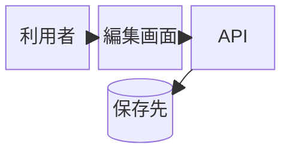

# Marp: ブロック図

Marpスライド内でPeleが描画するMermaidサンプルです。

構成要素を配置し、システム内の接続を表します。

```mermaid
block
    columns 3
    user["利用者"] editor["編集画面"] api["API"]
    space storage[("保存先")] space
    user --> editor
    editor --> api
    api --> storage
```
