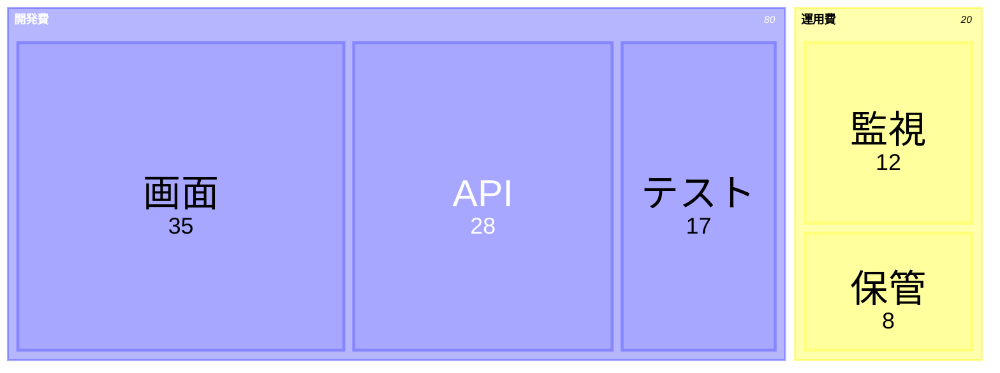

# Marp: ツリーマップ

Marpスライド内でPeleが描画するMermaidサンプルです。

階層ごとの値を、面積の異なる矩形で比較します。

```mermaid
treemap-beta
    "開発費"
        "画面": 35
        "API": 28
        "テスト": 17
    "運用費"
        "監視": 12
        "保管": 8
```
