<!-- 既存32種類のMermaid図をPeleで描画するMarpプレビュー検証用ギャラリーです。 -->
# Marp: フローチャートの基本

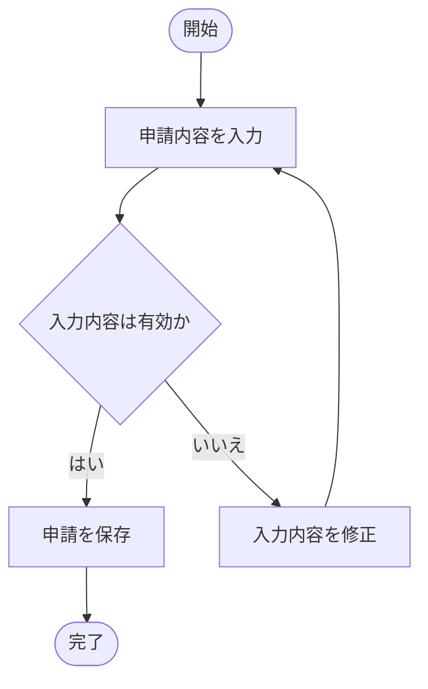
```mermaid
flowchart TD
    Start([開始]) --> Input[申請内容を入力]
    Input --> Check{入力内容は有効か}
    Check -->|はい| Save[申請を保存]
    Check -->|いいえ| Fix[入力内容を修正]
    Fix --> Input
    Save --> Done([完了])
```

---

# Marp: フローチャートの分岐

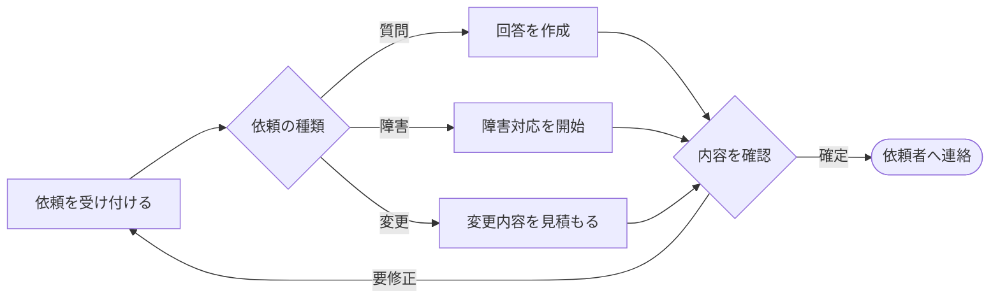
```mermaid
flowchart LR
    Request[依頼を受け付ける] --> Type{依頼の種類}
    Type -->|質問| Answer[回答を作成]
    Type -->|障害| Incident[障害対応を開始]
    Type -->|変更| Change[変更内容を見積もる]
    Answer --> Review{内容を確認}
    Incident --> Review
    Change --> Review
    Review -->|要修正| Request
    Review -->|確定| Publish([依頼者へ連絡])
```

---

# Marp: フローチャートのサブグラフ

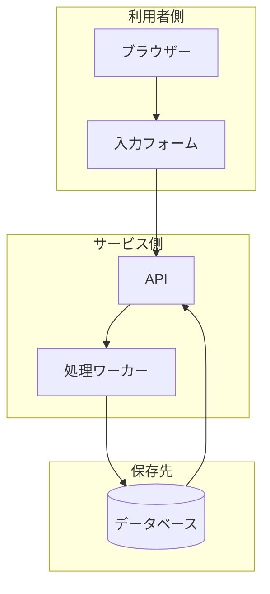
```mermaid
flowchart TB
    subgraph Client[利用者側]
        direction LR
        Browser[ブラウザー] --> Form[入力フォーム]
    end

    subgraph Service[サービス側]
        direction LR
        Api[API] --> Worker[処理ワーカー]
    end

    subgraph Storage[保存先]
        Database[(データベース)]
    end

    Form --> Api
    Worker --> Database
    Database --> Api
```

---

# Marp: フローチャートの図形とスタイル

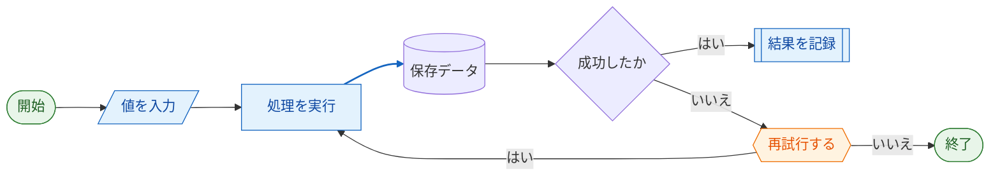
```mermaid
flowchart LR
    Start([開始]) --> Input[/値を入力/]
    Input --> Process[処理を実行]
    Process --> Data[(保存データ)]
    Data --> Decision{成功したか}
    Decision -->|はい| Document[[結果を記録]]
    Decision -->|いいえ| Retry{{再試行する}}
    Retry -->|はい| Process
    Retry -->|いいえ| End([終了])

    classDef entry fill:#e8f5e9,stroke:#2e7d32,color:#1b5e20
    classDef action fill:#e3f2fd,stroke:#1565c0,color:#0d47a1
    classDef warning fill:#fff3e0,stroke:#ef6c00,color:#e65100
    class Start,End entry
    class Input,Process,Document action
    class Retry warning
    linkStyle 2 stroke:#1565c0,stroke-width:2px
```

---

# Marp: シーケンス図の基本

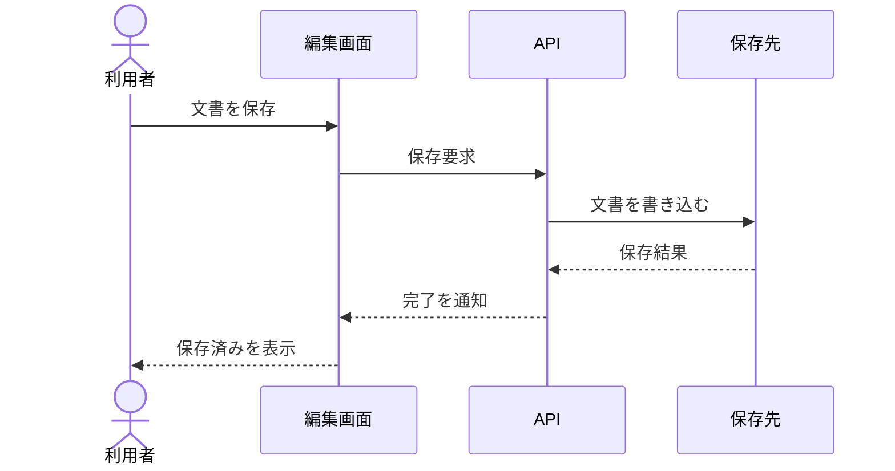
```mermaid
sequenceDiagram
    actor User as 利用者
    participant UI as 編集画面
    participant API as API
    participant DB as 保存先

    User->>UI: 文書を保存
    UI->>API: 保存要求
    API->>DB: 文書を書き込む
    DB-->>API: 保存結果
    API-->>UI: 完了を通知
    UI-->>User: 保存済みを表示
```

---

# Marp: シーケンス図の条件と並行処理

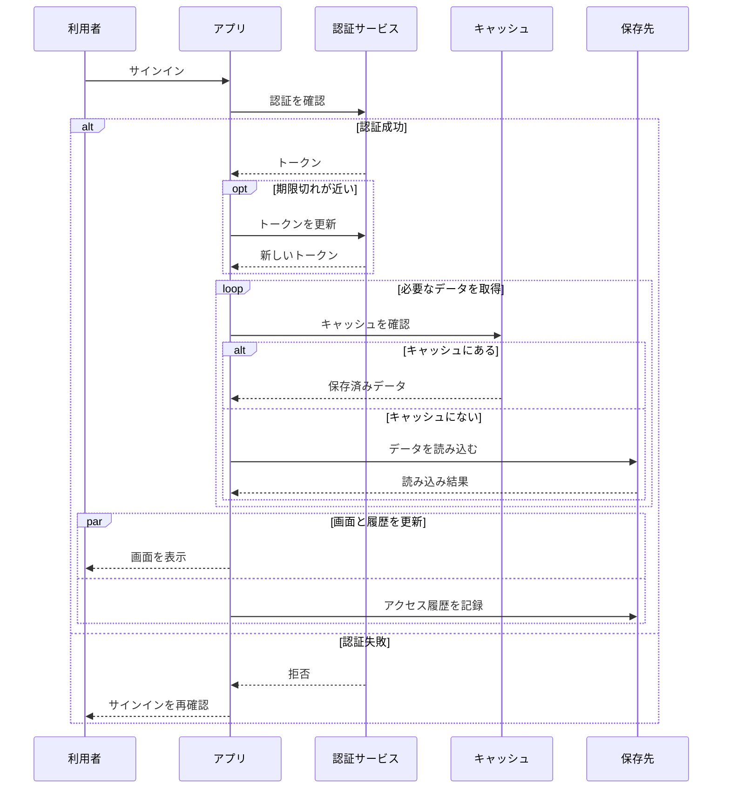
```mermaid {scale=50%}
sequenceDiagram
    participant User as 利用者
    participant App as アプリ
    participant Auth as 認証サービス
    participant Cache as キャッシュ
    participant Store as 保存先

    User->>App: サインイン
    App->>Auth: 認証を確認
    alt 認証成功
        Auth-->>App: トークン
        opt 期限切れが近い
            App->>Auth: トークンを更新
            Auth-->>App: 新しいトークン
        end
        loop 必要なデータを取得
            App->>Cache: キャッシュを確認
            alt キャッシュにある
                Cache-->>App: 保存済みデータ
            else キャッシュにない
                App->>Store: データを読み込む
                Store-->>App: 読み込み結果
            end
        end
        par 画面と履歴を更新
            App-->>User: 画面を表示
        and
            App->>Store: アクセス履歴を記録
        end
    else 認証失敗
        Auth-->>App: 拒否
        App-->>User: サインインを再確認
    end
```

---

# Marp: シーケンス図の注記と実行区間

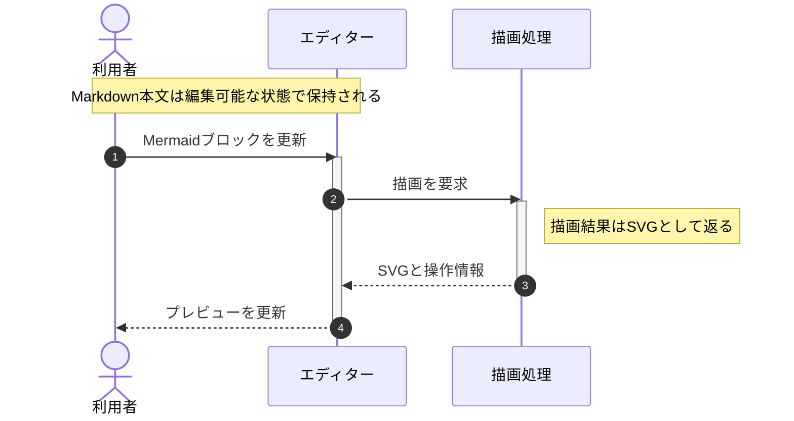
```mermaid
sequenceDiagram
    autonumber
    actor User as 利用者
    participant Editor as エディター
    participant Renderer as 描画処理

    Note over User,Editor: Markdown本文は編集可能な状態で保持される
    User->>Editor: Mermaidブロックを更新
    activate Editor
    Editor->>Renderer: 描画を要求
    activate Renderer
    Note right of Renderer: 描画結果はSVGとして返る
    Renderer-->>Editor: SVGと操作情報
    deactivate Renderer
    Editor-->>User: プレビューを更新
    deactivate Editor
```

---

# Marp: クラス図

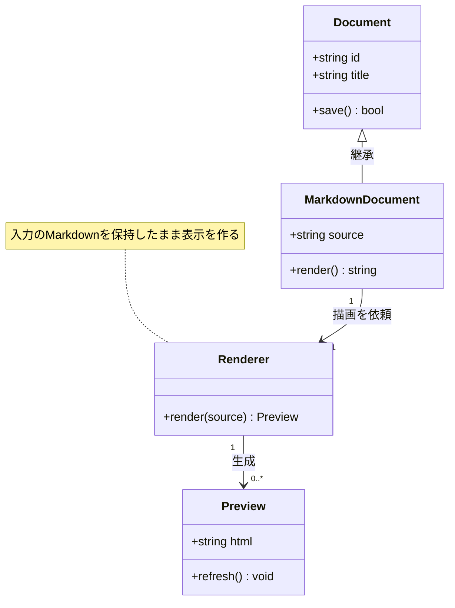
```mermaid {scale=65%}
classDiagram
    class Document {
        +string id
        +string title
        +save() bool
    }
    class MarkdownDocument {
        +string source
        +render() string
    }
    class Renderer {
        +render(source) Preview
    }
    class Preview {
        +string html
        +refresh() void
    }

    Document <|-- MarkdownDocument : 継承
    MarkdownDocument "1" --> "1" Renderer : 描画を依頼
    Renderer "1" --> "0..*" Preview : 生成
    note for Renderer "入力のMarkdownを保持したまま表示を作る"
```

---

# Marp: 状態遷移図の基本

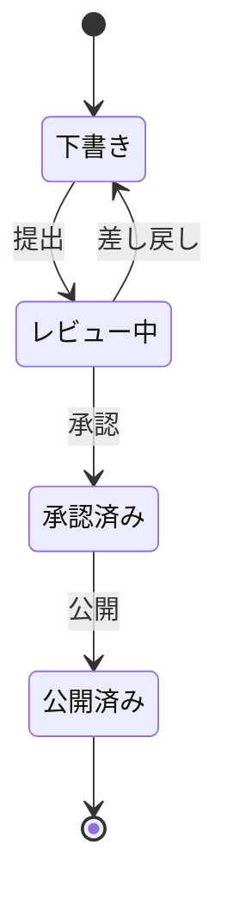
```mermaid
stateDiagram-v2
    [*] --> 下書き
    下書き --> レビュー中: 提出
    レビュー中 --> 承認済み: 承認
    レビュー中 --> 下書き: 差し戻し
    承認済み --> 公開済み: 公開
    公開済み --> [*]
```

---

# Marp: 状態遷移図の複合状態

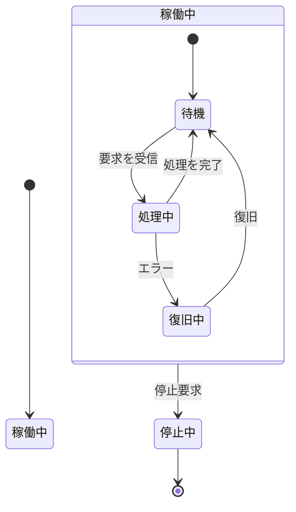
```mermaid {scale=65%}
stateDiagram-v2
    [*] --> 稼働中
    state "稼働中" as Active {
        [*] --> 待機
        待機 --> 処理中: 要求を受信
        処理中 --> 待機: 処理を完了
        処理中 --> 復旧中: エラー
        復旧中 --> 待機: 復旧
    }
    Active --> 停止中: 停止要求
    停止中 --> [*]
```

---

# Marp: ER 図

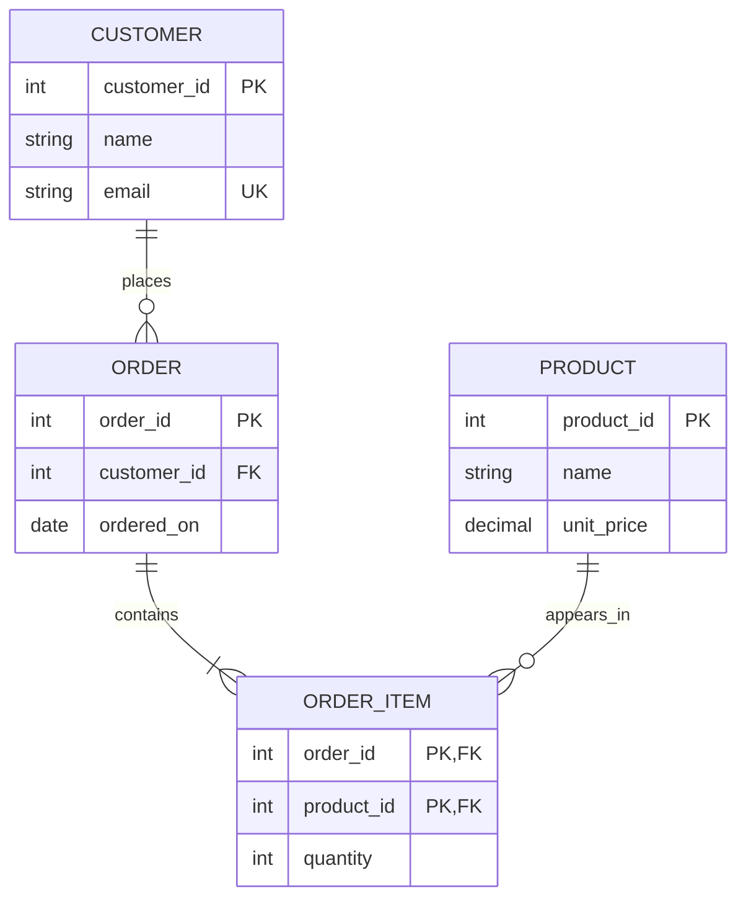
```mermaid {scale=90%}
erDiagram
    CUSTOMER ||--o{ ORDER : places
    ORDER ||--|{ ORDER_ITEM : contains
    PRODUCT ||--o{ ORDER_ITEM : appears_in
    CUSTOMER {
        int customer_id PK
        string name
        string email UK
    }
    ORDER {
        int order_id PK
        int customer_id FK
        date ordered_on
    }
    ORDER_ITEM {
        int order_id PK, FK
        int product_id PK, FK
        int quantity
    }
    PRODUCT {
        int product_id PK
        string name
        decimal unit_price
    }
```

---

# Marp: ガントチャートの基本

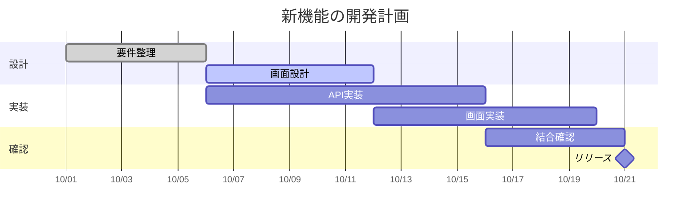
```mermaid
gantt
    title 新機能の開発計画
    dateFormat YYYY-MM-DD
    axisFormat %m/%d
    section 設計
        要件整理 :done, req, 2026-10-01, 5d
        画面設計 :active, ui, after req, 6d
    section 実装
        API実装 :api, after req, 10d
        画面実装 :front, after ui, 8d
    section 確認
        結合確認 :test, after api, 5d
        リリース :milestone, release, after test, 0d
```

---

# Marp: ガントチャートの依存関係

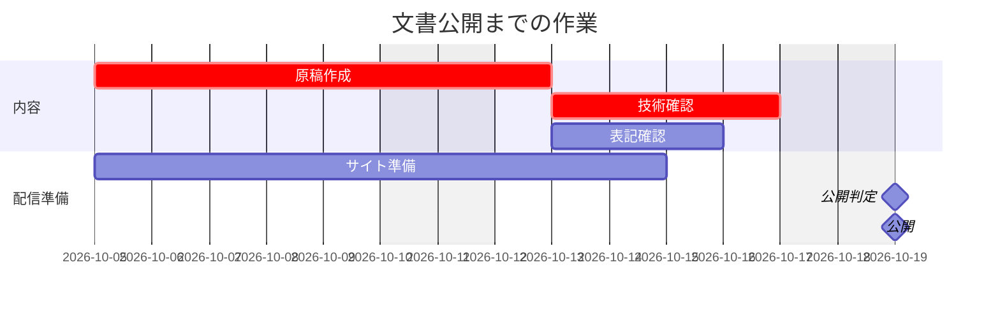
```mermaid
gantt
    title 文書公開までの作業
    dateFormat YYYY-MM-DD
    excludes weekends
    section 内容
        原稿作成 :crit, draft, 2026-10-05, 6d
        技術確認 :crit, review, after draft, 4d
        表記確認 :proof, after draft, 3d
    section 配信準備
        サイト準備 :site, 2026-10-05, 8d
        公開判定 :milestone, gate, after review, 0d
        公開 :milestone, launch, after gate, 0d
```

---

# Marp: 円グラフ

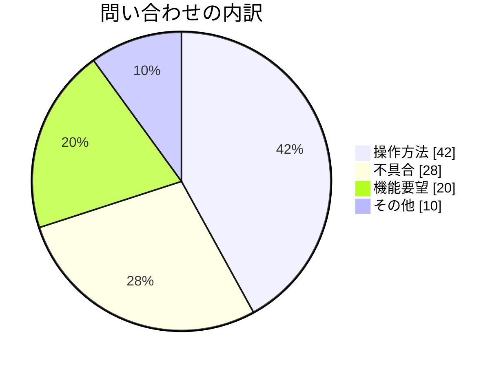
```mermaid
pie showData
    title 問い合わせの内訳
    "操作方法" : 42
    "不具合" : 28
    "機能要望" : 20
    "その他" : 10
```

---

# Marp: マインドマップ

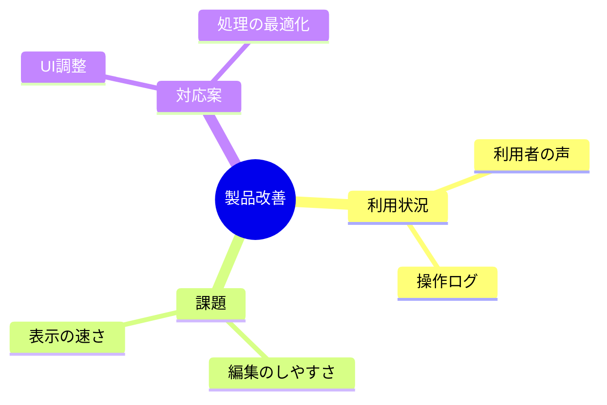
```mermaid
mindmap
  root((製品改善))
    利用状況
      利用者の声
      操作ログ
    課題
      編集のしやすさ
      表示の速さ
    対応案
      UI調整
      処理の最適化
```

---

# Marp: タイムライン

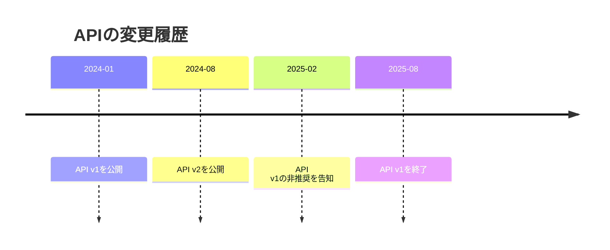
```mermaid
timeline
    title APIの変更履歴
    2024-01 : API v1を公開
    2024-08 : API v2を公開
    2025-02 : API v1の非推奨を告知
    2025-08 : API v1を終了
```

---

# Marp: Git グラフ

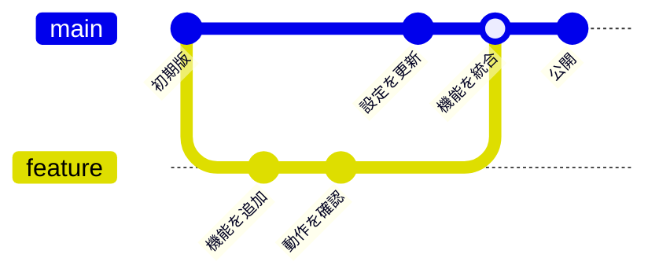
```mermaid
gitGraph LR:
    commit id: "初期版"
    branch feature
    checkout feature
    commit id: "機能を追加"
    commit id: "動作を確認"
    checkout main
    commit id: "設定を更新"
    merge feature id: "機能を統合"
    commit id: "公開"
```

---

# Marp: ユーザージャーニー

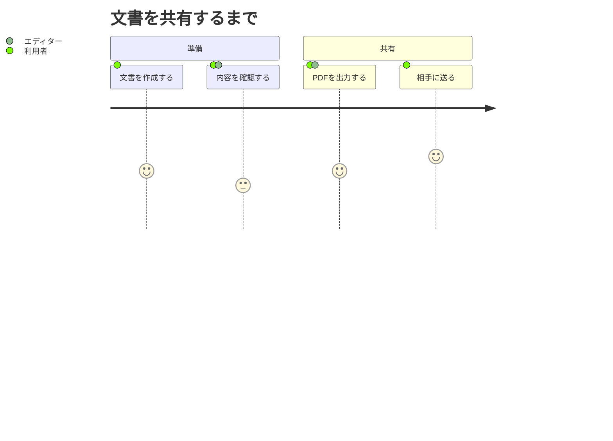
```mermaid
journey
    title 文書を共有するまで
    section 準備
        文書を作成する: 4: 利用者
        内容を確認する: 3: 利用者, エディター
    section 共有
        PDFを出力する: 4: 利用者, エディター
        相手に送る: 5: 利用者
```

---

# Marp: クアドラントチャート

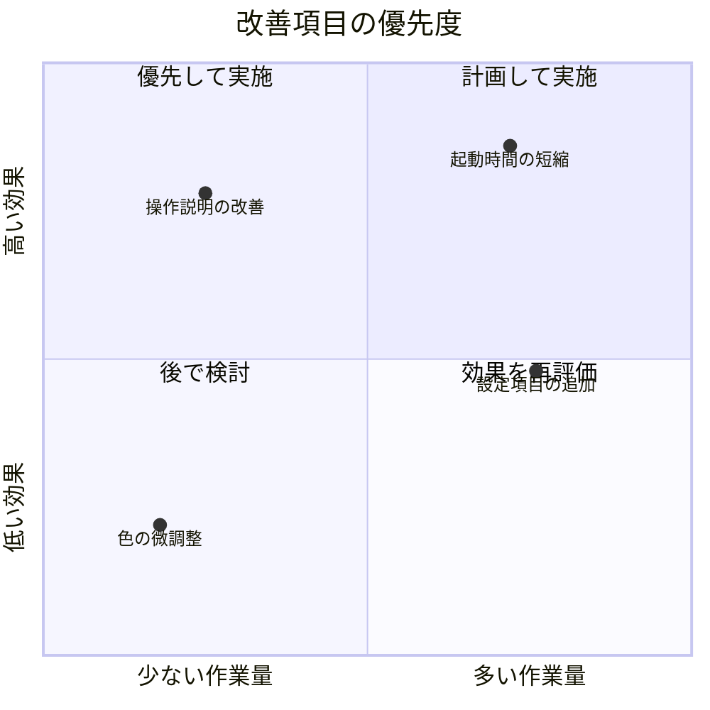
```mermaid
quadrantChart
    title 改善項目の優先度
    x-axis 少ない作業量 --> 多い作業量
    y-axis 低い効果 --> 高い効果
    quadrant-1 計画して実施
    quadrant-2 優先して実施
    quadrant-3 後で検討
    quadrant-4 効果を再評価
    操作説明の改善: [0.25, 0.78]
    起動時間の短縮: [0.72, 0.86]
    色の微調整: [0.18, 0.22]
    設定項目の追加: [0.76, 0.48]
```

---

# Marp: XY チャート

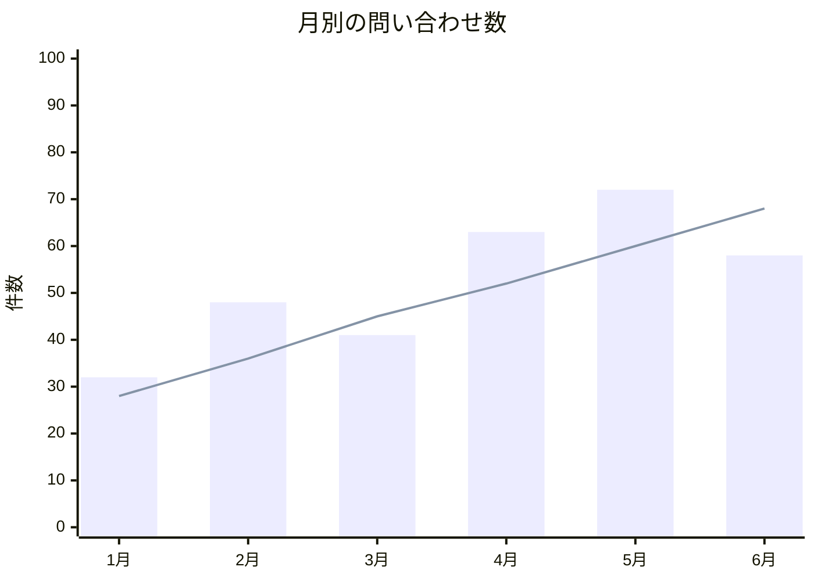
```mermaid
xychart
    title "月別の問い合わせ数"
    x-axis ["1月", "2月", "3月", "4月", "5月", "6月"]
    y-axis "件数" 0 --> 100
    bar [32, 48, 41, 63, 72, 58]
    line [28, 36, 45, 52, 60, 68]
```

---

# Marp: ブロック図

```mermaid
block
    columns 3
    user["利用者"] editor["編集画面"] api["API"]
    space storage[("保存先")] space
    user --> editor
    editor --> api
    api --> storage
```

---

# Marp: アーキテクチャ図

```mermaid
architecture-beta
    group cloud(cloud)["クラウド"]
    service client(internet)["利用者"] in cloud
    service api(server)["API"] in cloud
    service database(database)["データベース"] in cloud
    service files(disk)["ファイル保存"] in cloud

    client:R -- L:api
    api:B -- T:database
    api:B -- T:files
```

---

# Marp: サンキー図

```mermaid
sankey
Search,View,120
Referral,View,80
View,Signup,75
View,Exit,125
Signup,Complete,60
Signup,Abandon,15
```

---

# Marp: 要求図

```mermaid
requirementDiagram
    requirement saveRequirement {
        id: REQ1
        text: "文書を保存できる"
        risk: Low
        verifymethod: test
    }
    element editor {
        type: component
        docref: editor.md
    }
    element saveCheck {
        type: verification
        docref: saveTest
    }

    editor - satisfies -> saveRequirement
    saveCheck - verifies -> saveRequirement
```

---

# Marp: パケット図

```mermaid
packet
    0-15: "送信元ポート"
    16-31: "宛先ポート"
    32-63: "シーケンス番号"
    64-95: "確認応答番号"
    96-99: "データオフセット"
    100-105: "予約領域"
    106: "URG"
    107: "ACK"
    108: "PSH"
    109: "RST"
    110: "SYN"
    111: "FIN"
    112-127: "ウィンドウサイズ"
```

---

# Marp: C4 コンテキスト図

```mermaid
C4Context
    title 文書公開サービスのシステムコンテキスト
    Person(author, "作成者", "文書を作成して公開する")
    Person(reader, "閲覧者", "公開文書を読む")
    System(editor, "文書エディター", "文書を編集して出力する")
    System_Ext(storage, "ファイル保存先", "公開ファイルを保管する")
    Rel(author, editor, "文書を作成")
    Rel(editor, storage, "ファイルを保存")
    Rel(reader, storage, "文書を閲覧")
```

---

# Marp: ツリーマップ

```mermaid
treemap-beta
    "開発費"
        "画面": 35
        "API": 28
        "テスト": 17
    "運用費"
        "監視": 12
        "保管": 8
```

---

# Marp: カンバン

```mermaid
kanban
    todo[未着手]
        read[サンプルを読む]
        choose[図の種類を選ぶ]
    doing[作業中]
        edit[図を編集する]
    done[完了]
        review[表示を確認する]
```

---

# Marp: レーダーチャート

```mermaid
radar-beta
    title 編集体験の比較
    axis speed["表示速度"], ease["操作性"]
    axis access["アクセシビリティ"], docs["説明の充実度"]
    curve current["現状"]{72, 68, 80, 55}
    curve target["目標"]{88, 85, 90, 82}
    min 0
    max 100
    graticule polygon
```

---

# Marp: ツリービュー

```mermaid
treeView-beta
    "文書プロジェクト"/
        "仕様"/
            "要件.md"
            "画面設計.md"
        "サンプル"/
            "flowchart.md"
            "sequence.md"
        "README.md"
```

---

# Marp: スイムレーン図

```mermaid
swimlane-beta LR
    subgraph 利用者
        request[依頼を送る]
        confirm[結果を確認する]
    end
    subgraph サポート
        triage[依頼を分類する]
        respond[回答を作成する]
    end
    request --> triage
    triage --> respond
    respond --> confirm
```

---

# Marp: イベントモデリング

```mermaid
eventmodeling
    tf 01 ui OrderScreen
    tf 02 cmd CreateOrder
    tf 03 evt OrderReceived
    tf 04 rmo OrderList
    tf 05 cmd CancelOrder
    tf 06 evt OrderCancelled
    tf 07 rmo OrderList
```
