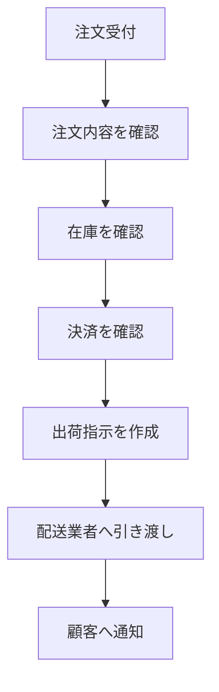

# 縦長の図

長いフローチャートは、スライドの高さを超える場合があります。次の図は標準サイズの例です。

```mermaid
flowchart TD
    A[注文受付] --> B[注文内容を確認]
    B --> C[在庫を確認]
    C --> D[決済を確認]
    D --> E[出荷指示を作成]
    E --> F[配送業者へ引き渡し]
    F --> G[顧客へ通知]
```

---

# 図だけを縮小する

同じ図に`{scale=65%}`を指定しています。縦横比を保って縮小され、指定は図ごとに独立します。

```mermaid {scale=65%}
flowchart TD
    A[注文受付] --> B[注文内容を確認]
    B --> C[在庫を確認]
    C --> D[決済を確認]
    D --> E[出荷指示を作成]
    E --> F[配送業者へ引き渡し]
    F --> G[顧客へ通知]
```
